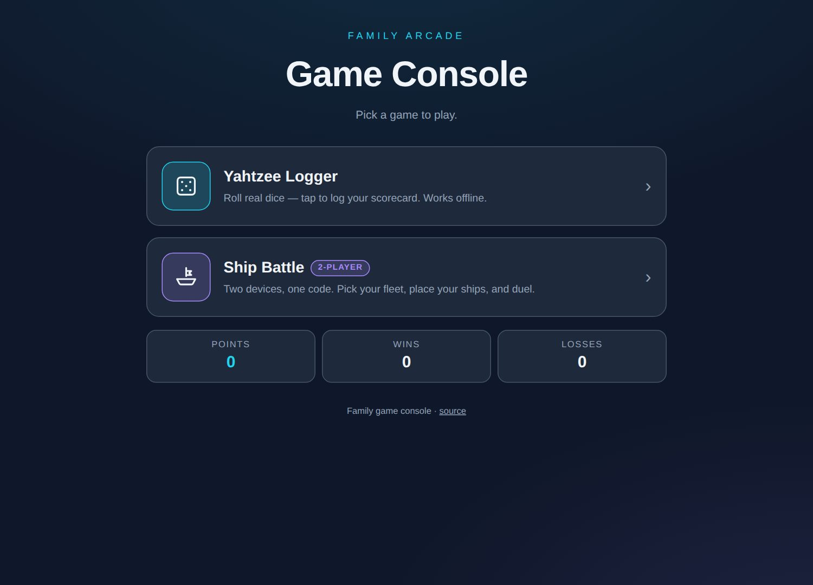
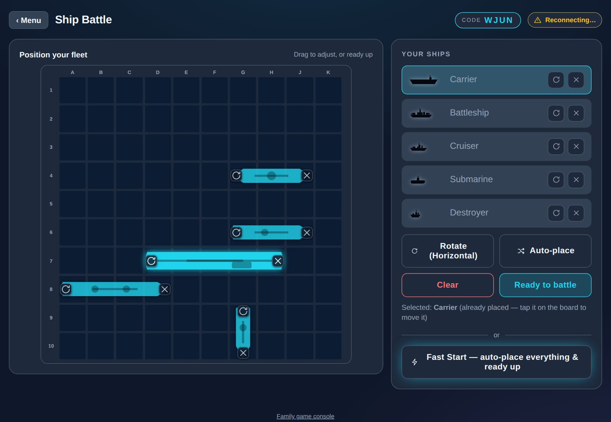
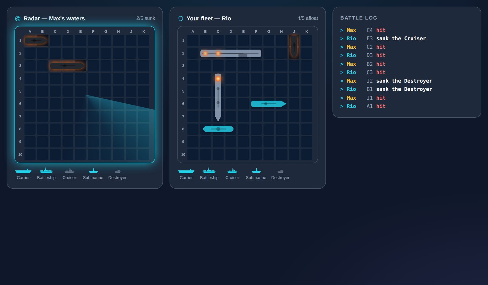
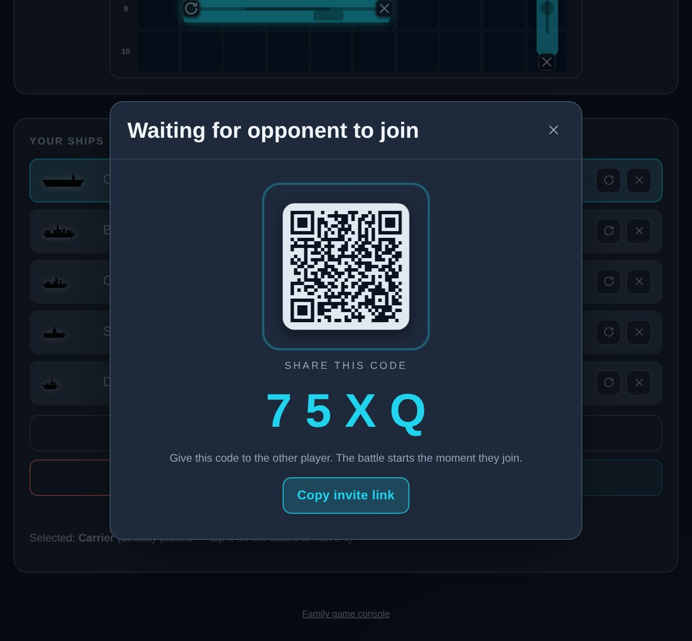
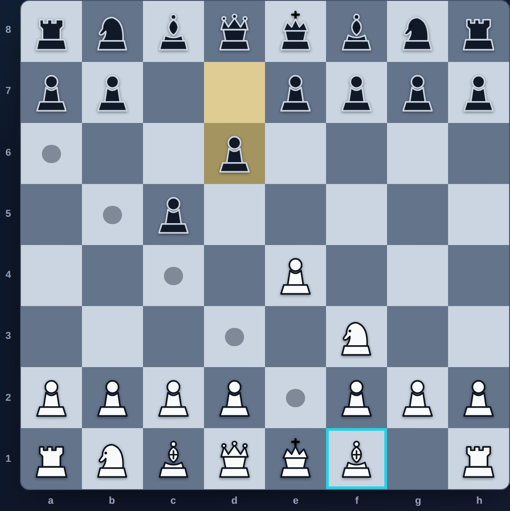
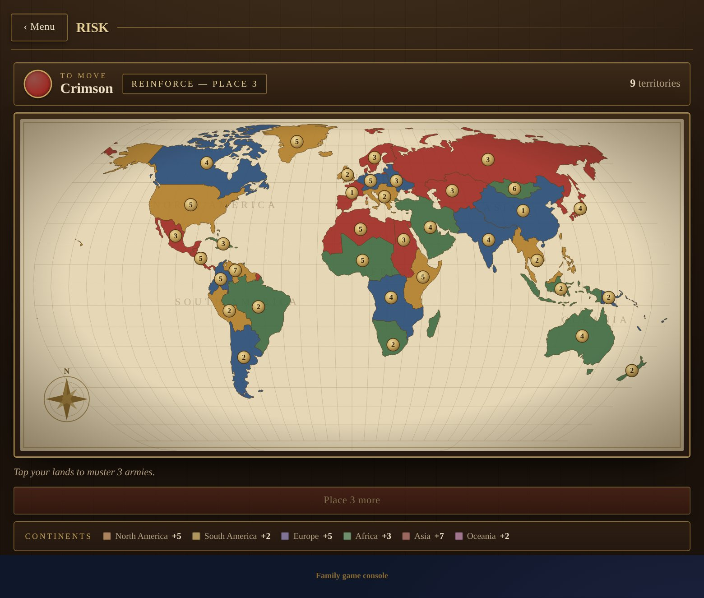

# Kny-Flores Family Arcade

A small family-friendly game console that lives on GitHub Pages:

- **Yahtzee Logger** — a mobile-first score logger (roll real dice, tap to log). One self-contained HTML file, works fully offline.
- **Ship Battle** — a two-player, cross-device naval guessing game (a Battleship-style game; "Battleship" is a trademark of Hasbro and is not affiliated). Two iPads, one shared code, no server.
- **Chess** — full-rules, drag-and-drop chess for two players: pass-and-play on one device, or online over a shared code.
- **Risk** — world-conquest for 2–6 players on one shared board (hot-seat): reinforce, attack with dice, and take over a real-geography world map.

**Play it:** https://arcade.knyflores.com/

It's free and open source — the whole thing lives in this repo.

---

## Screenshots

| The console | Place your fleet |
| --- | --- |
|  |  |

| Battle view | Share the game code |
| --- | --- |
|  |  |

| Chess | Risk |
| --- | --- |
|  |  |

---

## Ship Battle

Two people on two different devices play a turn-based naval guessing game connected only by a short game code.

- **Peer-to-peer** over WebRTC (via [PeerJS](https://peerjs.com/)). One player taps **Create a game** and gets a 4-character code (and a shareable invite link); the other taps **Join** and types it in. Game data then flows device-to-device.
- **Pick your fleet** — choose a cosmetic skin (free ones plus premium skins unlocked with points).
- **Place your ships** on your own board (tap-to-place, rotate, or auto-place).
- **Two battle boards** — a **Radar** view (your shots on the enemy) and a **Fleet** view (your ships + incoming fire), side-by-side on a tablet or tabbed on a phone, with a live battle log.
- **Points & history** — win to earn points (bonus for a decisive victory), spend them on cooler fleets. Records and unlocks persist in `localStorage`.
- **Resume anywhere** — the whole game is an event-sourced log persisted on each device. Step away, lose signal, or refresh, and reconnecting with the same code replays the history and picks up exactly where you left off.
- **Installable PWA** — add it to the iPad home screen; the app shell is cached so it opens instantly even on a flaky connection.

### How resume / reconnect works

The shared truth is an **append-only log of settled shots**. Everything the UI shows — whose turn it is, which cells are hit, who won — is a pure function of that log (plus your own private ship placement). A settled shot is authored only by the *defender* (the one who can resolve it against their own board), and turns strictly alternate, so exactly one device writes each log entry. That single-writer property means two reconnecting peers reconcile trivially: **the longer log wins**, with no merge conflicts. A dropped message or a mid-game disconnect self-heals on the next sync.

This is covered end-to-end by a test that simulates a full two-peer game *including a mid-game outage* and asserts both peers converge on the same finished game (`src/game/session.test.ts`).

---

## Chess

A full-rules chess game with drag-and-drop (or tap-to-move), playable two ways:

- **Same device** — pass-and-play on one screen; the board tells you whose move it is.
- **Online** — two devices connected by a 4-character code, exactly like Ship Battle (host plays White, guest plays Black). Reconnects and resumes the same way.

Every real rule is enforced: legal move generation, castling, en passant, promotion (with a piece picker), check, checkmate, stalemate, plus the fifty-move and insufficient-material draws. Illegal moves simply don't happen — you can only drop a piece on a legal square, and you can never leave your own king in check.

The engine is a self-contained, pure module (`src/games/chess/domain/`) with no UI or network dependencies, verified by **perft** node-count tests — the gold standard for a move generator (the opening tree matches 20 / 400 / 8902 at depths 1–3, and the "Kiwipete" position matches 48 / 2039). Online play reuses the same event-sourced-log design as Ship Battle: the shared truth is the list of played moves, each authored by the side to move, so two peers reconcile by **"the longer log wins."** The peer transport (`src/shared/net/peer.ts`) is generic over the message type, so both games share one WebRTC layer.

---

## Risk

World conquest for **2–6 players on one shared device** (hot-seat, open information). Each turn is the classic loop: **reinforce** (armies from your territory count plus a bonus for every continent you fully hold) → **attack** (roll dice, 3 v 2, defender wins ties) → **fortify** (one move between connected territories). Eliminated players drop out; the last one standing conquers the world.

- **Pluggable, data-driven maps.** The rules engine (`src/games/risk/domain/`) is map-agnostic — it only sees an abstract topology (which territories exist, their continents/bonuses, and who borders whom). A map is a self-contained module under `src/games/risk/maps/` that produces that topology plus the rendered SVG. Adding another map is one new module in the map registry; nothing in the engine or UI hard-codes "world".
- **Real geography, offline.** The World map is built from real country outlines (`world-atlas`, Natural Earth — MIT, bundled into the app) projected to SVG with `d3-geo`. No tile server and no network: the whole map ships in the build, so it works offline like the rest of the console.

The engine is fully unit-tested (deal, reinforcement + continent bonuses, dice combat, capture, fortify connectivity, elimination/win), and the World map has integrity tests (symmetric adjacency, one connected landmass, every territory in exactly one continent).

---

## Development

Requires Node 20+.

```bash
npm install
npm run dev        # local dev server
npm test           # run the test suite (Vitest)
npm run typecheck  # strict TypeScript, no emit
npm run build      # production build → dist/
npm run preview    # serve the production build locally
```

### Project layout

The app is organised so each game is **self-contained** and the shared platform
is thin. Deleting a game is its folder plus one line in `app/registry.ts`.

```
index.html               Vite entry → src/app/main.tsx
public/calculator.html   the Yahtzee logger (standalone, vanilla)
src/
  shared/                the thin platform every game builds on
    net/peer.ts          generic PeerJS transport (connect, retry, reconnect)
    profile/             game-neutral points/wins/unlocks + persistence
    storage/kv.ts        defensive localStorage helpers
    ui/                  ConnectionBadge, VictoryFX, the icon set
    styles/tokens.css    shared design system + result/animation styles
    game.ts              the GameDescriptor contract each game exposes
  games/
    battleship/          everything Ship Battle
      domain/            pure rules (types, constants, board, engine, protocol, session, skins)
      state/             useBattleship, useShipDrag
      storage/           resumable-game persistence
      components/        Lobby, FleetSelect, Placement, Board, Battle, Result, page
      styles/battleship.css
      index.ts           its GameDescriptor
    chess/               everything Chess (same shape: domain / state / storage / components / styles / index.ts)
    risk/                everything Risk
      domain/            map-agnostic rules (types, rules) + tests
      maps/              pluggable maps: world.ts (real geography via d3-geo) + registry
      components/        RiskBoard, RiskPage
      styles/risk.css
      index.ts           its GameDescriptor
  app/
    Menu.tsx             registry-driven landing menu
    registry.ts          the ONE list of games
    main.tsx             router built from the registry
    styles/app.css
```

Path aliases (`@shared`, `@games`, `@app`) keep imports independent of nesting
depth. The design principle: **all game rules live in pure, tested modules**;
React and the network layer are thin wiring around them, and the shared platform
never imports a game (only the reverse), so games stay separable.

---

## Deploy

Deployment is automated by GitHub Actions (`.github/workflows/deploy.yml`): every push to `main` builds the app, runs the tests, and publishes `dist/` to GitHub Pages.

**One-time setup:**

1. In the repo, go to **Settings → Pages → Build and deployment → Source** and choose **GitHub Actions**.
2. **Custom domain** — the arcade is served at `arcade.knyflores.com`:
   - `public/CNAME` pins the domain (it ships in `dist/`).
   - At the DNS provider for `knyflores.com`, add a `CNAME` record: `arcade` → `rio517.github.io`.
   - In **Settings → Pages → Custom domain**, confirm `arcade.knyflores.com` and enable **Enforce HTTPS** once the certificate is issued.
   - The app is built with a root base path (`/`) for the custom domain. To serve from the bare `github.io` project URL instead, build with `BASE_PATH=/yahtzee-calculator/`.

The Yahtzee logger remains a single vanilla HTML file — served as `calculator.html`, no build required.
