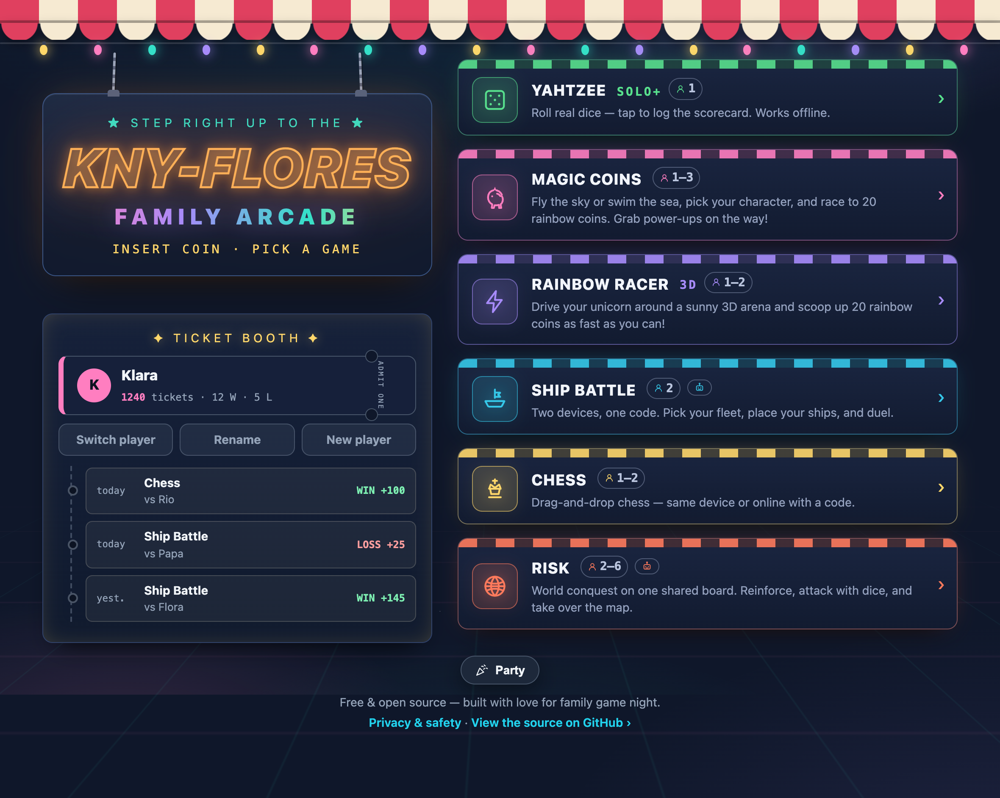
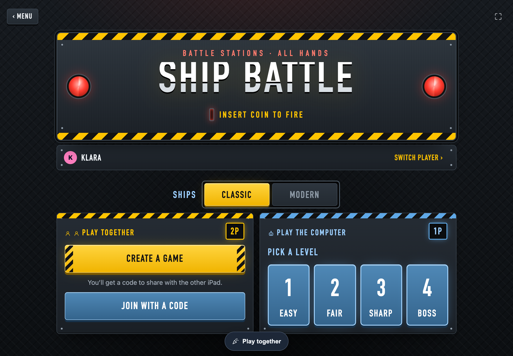
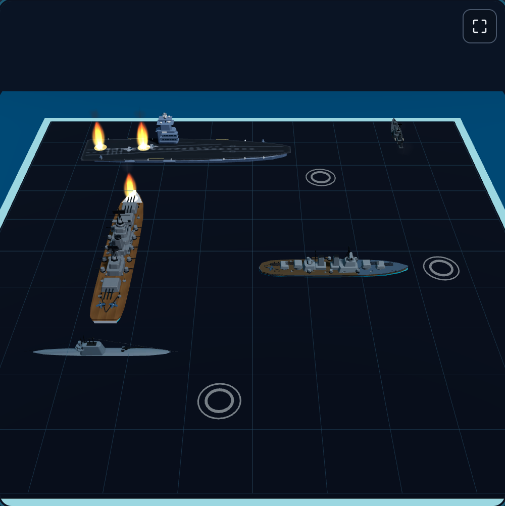
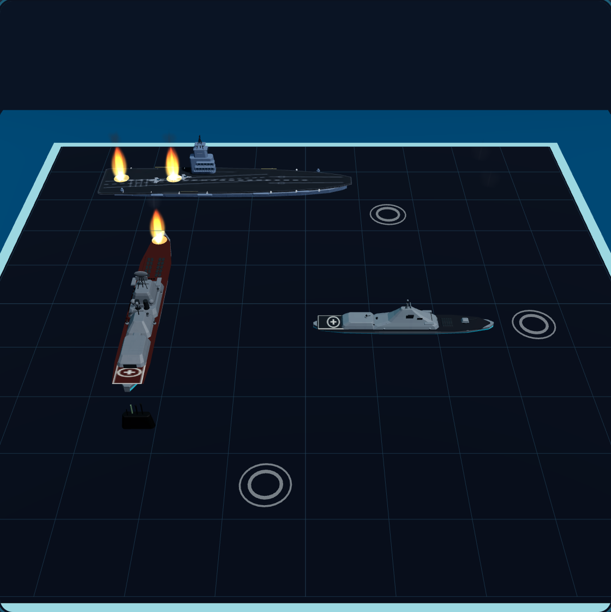
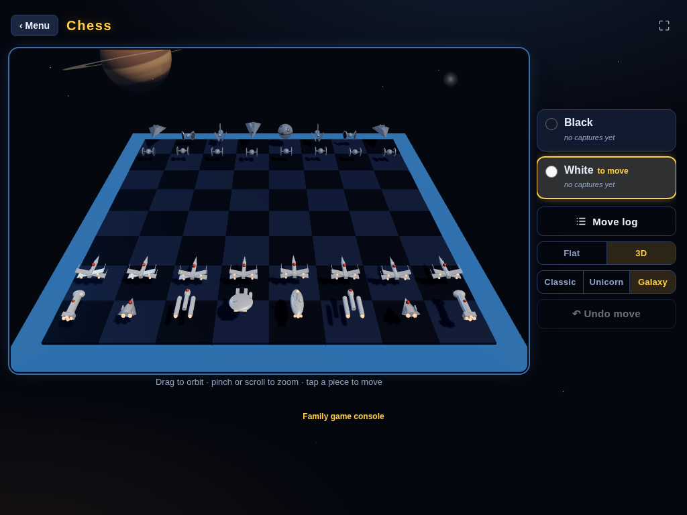
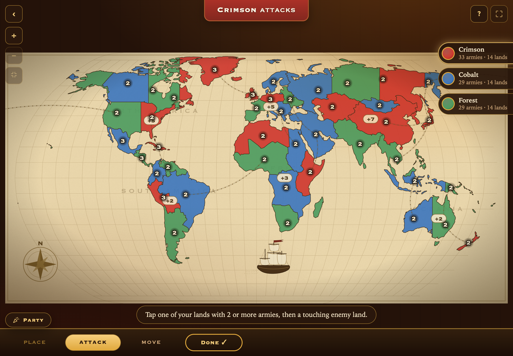
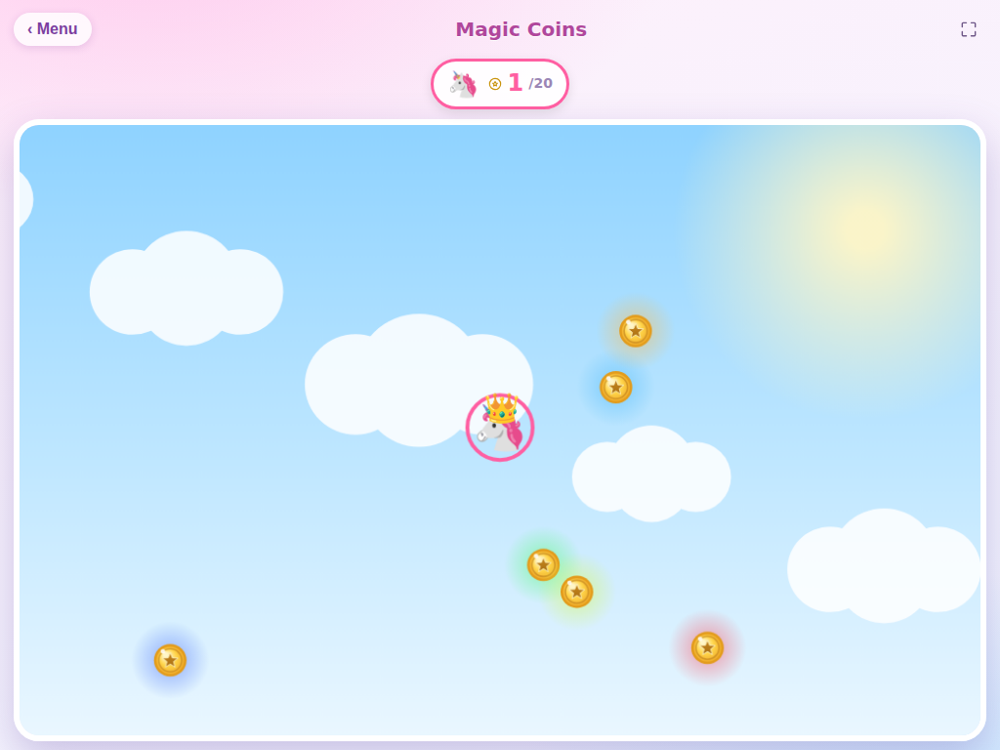
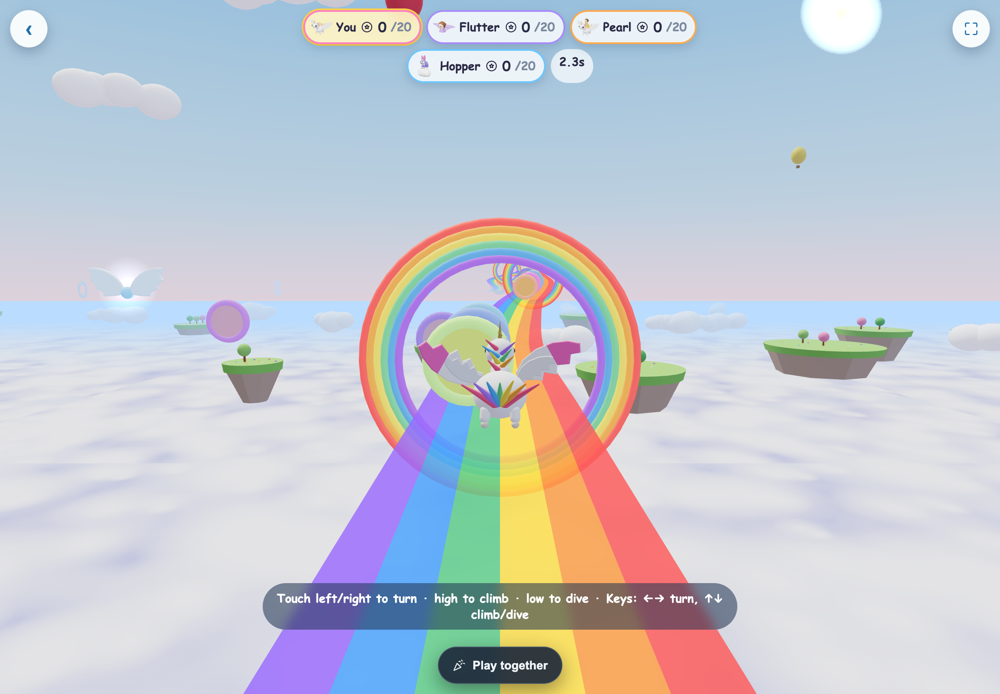

# Kny-Flores Family Arcade

A small family game console that lives on GitHub Pages — five games plus a
score logger, installable as an offline PWA:

- **Magic Coins** — fly the sky or swim the sea (1–3 players), pick your
  character, and race to 20 rainbow coins. Grab power-ups on the way!
- **Rainbow Racer** — a kart race in the sky (1–2 players): fly anywhere over
  a sea of clouds as a unicorn or a fairy, or ride one — a princess on a
  flying unicorn, a bunny on a cloud. A rainbow road leads the way. First to
  20 coins wins; rainbow rings give a burst of speed, and power-ups make you
  bigger, give you big wings, or lay a line of coins ahead.
- **Gulp Universe** — be a hungry hole in a toy 3D city (1 player against the
  computer): swallow cones, then cars, buses, towers, stadiums and mountains,
  and grow without limit across four maps from a Town to a whole Region.
  Optional power-ups and a city that fights back with fuel trucks and planes.
- **Ship Battle** — a two-player, cross-device naval guessing game (a
  Battleship-style game; "Battleship" is a trademark of Hasbro and is not
  affiliated). Two iPads, one shared code, no server — or play solo against a
  ladder of computer captains. Two full 3D navies: every captain chooses
  **Classic** (Shōkaku, Iowa, Cleveland, a Type VII U-boat, Fletcher) or
  **Modern** (Ford, Kirov, Type 055, Virginia, Hobart).
- **Chess** — full-rules chess with three worlds (the War Room, the unicorn
  Cloud Kingdom, and a starship Galaxy), playable flat or on a 3D board where
  you drag the pieces themselves. Pass-and-play or online over a shared code,
  plus a free-play sandbox for inventing positions.
- **Risk** — world conquest for 2–6 players on one shared board (hot-seat)
  across a real-geography world map, with seatable computer generals from
  gentle to fierce.
- **Yahtzee Logger** — a mobile-first score logger (roll real dice, tap to
  log). One self-contained HTML file, works fully offline.

**Play it:** https://arcade.knyflores.com/

It's free and open source — the whole thing lives in this repo. Want to add a
game? `npm run new-game` puts a starter on the wall;
[CONTRIBUTING.md](CONTRIBUTING.md) has the rest.

---

## Screenshots

| The console | Choose your navy |
| --- | --- |
|  |  |

| The classic fleet | The modern fleet |
| --- | --- |
|  |  |

| Galaxy chess | Risk |
| --- | --- |
|  |  |

| Magic Coins | Rainbow Racer |
| --- | --- |
|  |  |

---

## Ship Battle

Two people on two different devices play a turn-based naval guessing game
connected only by a short game code — or one person takes on the computer.

- **Peer-to-peer** over WebRTC (via [PeerJS](https://peerjs.com/)). One player
  taps **Create a game** and gets a 4-character code (and a shareable invite
  link with a QR code); the other taps **Join** and types it in. Game data then
  flows device-to-device.
- **Computer captains** — a solo ladder of opponents from pushover to
  merciless, each a deterministic hunt/target policy (no AI service, works
  offline like everything else).
- **Pick your fleet, then pick your navy** — a cosmetic colour skin (free ones
  plus premium skins unlocked with points), and a separate **Classic / Modern**
  choice of which real navy sails for you in 3D. Every captain picks their
  own, so 1942 can battle 2030.
- **A real 3D ocean** — your fleet rides the swell as authored, optimised
  models with your fleet colour on every waterline. Hits burn with smoke and
  flame, and a sunk ship founders for real: over thirty seconds it lists,
  slips underwater, and leaves only smoke on the surface.
- **Two battle boards** — a **Radar** view (your shots on the enemy) and a
  **Fleet** view (2D grid or the 3D ocean), side-by-side on a tablet or tabbed
  on a phone. The battle log lives in a one-line strip — tap it for the full
  record.
- **Points & history** — win to earn points (bonus for a decisive victory),
  spend them on cooler fleets. Records and unlocks persist in `localStorage`.
- **Resume anywhere** — the whole game is an event-sourced log persisted on
  each device. Step away, lose signal, or refresh, and reconnecting with the
  same code replays the history and picks up exactly where you left off.
- **Installable PWA** — add it to the iPad home screen; everything (including
  both navies' 3D models) is cached, so it opens and plays with no connection.

### How resume / reconnect works

The shared truth is an **append-only log of settled shots**. Everything the UI
shows — whose turn it is, which cells are hit, who won — is a pure function of
that log (plus your own private ship placement). A settled shot is authored
only by the *defender* (the one who can resolve it against their own board),
and turns strictly alternate, so exactly one device writes each log entry.
That single-writer property means two reconnecting peers reconcile trivially:
**the longer log wins**, with no merge conflicts. A dropped message or a
mid-game disconnect self-heals on the next sync.

This is covered end-to-end by a test that simulates a full two-peer game
*including a mid-game outage* and asserts both peers converge on the same
finished game.

---

## Chess

A full-rules chess game playable two ways and dressed three ways:

- **Same device** — pass-and-play on one screen; the board tells you whose
  move it is.
- **Online** — two devices connected by a 4-character code, exactly like Ship
  Battle (host plays White, guest plays Black). Reconnects and resumes the
  same way.
- **Three worlds** — the classic leather-and-brass **War Room**, the unicorn
  **Cloud Kingdom** on a floating terrace, and the **Galaxy**: Comet Guard ships vs
  the Nebula Fleet over a starfield, where authored, textured models are joining
  the set piece by piece.
- **A real 3D board** — orbit, pinch, and **drag the pieces themselves** to
  move (taps work too); legal targets light up under a lifted piece.
- **Free play** — a rules-free sandbox with piece trays: build any position by
  drag or tap, then promote it into a real rules-bound game.

Every real rule is enforced: legal move generation, castling, en passant,
promotion (with a piece picker), check, checkmate, stalemate, plus the
fifty-move and insufficient-material draws. The engine is a self-contained,
pure module (`src/games/chess/domain/`) verified by **perft** node-count tests
— the gold standard for a move generator (the opening tree matches 20 / 400 /
8902 at depths 1–3, and the "Kiwipete" position matches 48 / 2039). Online
play reuses the same event-sourced-log design as Ship Battle; the peer
transport (`src/shared/net/peer.ts`) is generic over the message type, so the
games share one WebRTC layer.

---

## Risk

World conquest for **2–6 players on one shared device** (hot-seat, open
information). Each turn is the classic loop in kid-plain words: **place
armies** (from your territory count plus a bonus for every continent you fully
hold — the income is stamped right on the map) → **attack** (dice, 3 v 2,
defender wins ties, and you choose how many armies march into a conquest) →
**move** (one transfer between connected territories). The last general
standing conquers the world.

- **Computer generals** — seat a bot in any chair, from gentle to fierce; each
  is a seeded, deterministic policy that plays by the same rules you do.
- **Fast openings** — starting armies scale to your share of the map plus a
  small reserve, so the fun starts in minutes, not after a hundred taps.
- **Wild or balanced dice** — pure luck, or dice drawn from a fair bag so
  cruel streaks can't happen.
- **A war-room map you can hold** — parchment, brass, and a colour-washed
  world you pinch-zoom and pan on a tablet; the active general's plaque wears
  their colour. Campaigns autosave and resume from the setup screen.
- **Pluggable, data-driven maps.** The rules engine (`src/games/risk/domain/`)
  is map-agnostic — it only sees an abstract topology (which territories
  exist, their continents/bonuses, and who borders whom). A map is a
  self-contained module under `src/games/risk/maps/` producing that topology
  plus the rendered SVG; nothing in the engine or UI hard-codes "world".
- **Real geography, offline.** The World map is built from real country
  outlines (`world-atlas`, Natural Earth — MIT, bundled) projected to SVG with
  `d3-geo`. No tile server: the whole map ships in the build.

The engine is fully unit-tested (deal, reinforcement + continent bonuses, dice
combat, capture and advance, fortify connectivity, elimination/win), and the
World map has integrity tests (symmetric adjacency, one connected landmass,
every territory in exactly one continent).

---

## Magic Coins & Rainbow Racer

The little-kid corner of the console, and just as engineered as the rest:

- **Magic Coins** (1–3 players) — pick a character and a world (sky, ocean, or
  rainbow), race to 20 coins, and grab power-ups along the way. Everyone plays
  on one screen at once.
- **Rainbow Racer** (1–2 players) — an open sky with no edge, built cell by
  cell around the camera from a seeded hash, so both devices in a two-player
  race see the same sky without sending it. One player races three computer
  rivals whose pace follows the score, so a young child usually wins and
  never by a mile.

---

## Gulp Universe

Be a hungry hole and swallow a toy city, from cones to wonders. Four maps
(Town, City, Megalopolis, Region), Easy / Medium / Hard, optional power-ups,
and an option for the city to fight back. The computer holes follow plain
rules (no AI), slowing down when they are ahead of the child. The world is
pure, seeded rules in `src/games/gulp/domain/`; the 3D city is procedural
three.js in `src/games/gulp/three/`.

**Dev-only tools.** None of these ship in the installed app.

| Where | What it shows |
|---|---|
| `/preview-gulp.html` | The asset gallery: every model standing over the smallest mouth that can swallow it, with its points and level, and a slider for a test mouth. `?kind=stadium` shows one kind in all its colours; `?tier=5` shows one tier. |
| Explore, in a round on `/#/gulp` | The chip bottom left, or the `` ` `` key: pauses the round and frees the camera over the whole city. Drag to move, scroll or pinch to zoom, arrows to slide; `` ` `` or Escape to go back. |
| `window.__gulp` on `/#/gulp` | The live world (holes, props, the city), for browser checks: jump to a giant hole, start an attack. |
| `window.__gulpScene` on `/#/gulp` | The live 3D scene (renderer stats, effects, the camera tour). |
| `npm run perf:gulp` | A local performance audit: Lighthouse on the Gulp menu, and frame times while playing a round. Run it from time to time; it prints a table against budgets. `-- --map=region --frames-only` times another map and skips Lighthouse. |

The preview page and the two globals exist on the dev server
(`npm run dev:tidewave`, port 5178); the preview page is also in harness
builds (`BUILD_HARNESS=1`, which `npm run shots` sets).

---

## Development

Requires **Node 20** (the version CI runs; Node 26's experimental
`localStorage` global currently breaks the jsdom test setup). The repo pins it
machine-readably — `mise` and `nvm`/`fnm` switch automatically via `mise.toml` /
`.nvmrc`, and `package.json`'s `engines` field documents the floor.

```bash
npm install
npm run dev        # local dev server
npm test           # run the test suite (Vitest)
npm run check      # typecheck + ESLint + knip dead-code — what CI gates on
npm run build      # production build → dist/
npm run preview    # serve the production build locally
npm run shots      # build, serve, and screenshot every view into docs/screenshots/
npm run new-game   # scaffold a playable starter game (docs/development/adding-a-game.md)
npm run glb        # optimise a 3D model for the bundle (see scripts/optimize-glb.mjs)
```

### Coding agents (Claude Code, Codex)

The agent setup is in the repo, so it works for anyone who clones it:

- **Instructions:** `AGENTS.md` (the working agreements for every agent:
  architecture, the git workflow, how to verify a change), `CLAUDE.md`
  (imports it for Claude Code), `.claude/skills/audit/` (the `/audit`
  codebase sweep), and `.claude/skills/arcade-game-playbook/` (how games get
  built, tuned and shipped here).
- **Tidewave** (run code in the live app, read its logs, use the page): the
  `tidewave()` Vite plugin serves it from the dev server,
  `npm run dev:tidewave` on `127.0.0.1:5178`. `.mcp.json` (Claude Code) and
  `.codex/config.toml` (Codex) connect to
  `http://127.0.0.1:5178/tidewave/mcp`. The tools exist only while that
  server runs, and a session looks for them when it starts. If the server
  came up later, reconnect (`/mcp` in Claude Code) or restart the session.
  The plugin turns itself off in `vite build`, so it never reaches the app.
- **Permissions:** `.claude/settings.json` lets routine commands run
  without a prompt: the npm scripts, the test and lint tools, everyday git
  commands except push, and `gh pr` and `gh run`. It asks first before a
  force-push, deleting a remote branch, `npm publish` or `rm -rf`. Personal
  additions go in `.claude/settings.local.json`, which git ignores.
- **Browsers** are headless: `npm run shots` drives Playwright's own
  Chromium and WebKit. For measuring the page live, bring your own headless
  Playwright or Chrome DevTools MCP; the repo doesn't configure one.

What you bring yourself: Claude Code or Codex, signed in; Node 20 (from
`mise.toml` or `.nvmrc`); and Playwright's browsers, installed once with
`npx playwright install chromium webkit`. Nothing here depends on a
particular machine or a parent folder.

### Project layout

The app is organised so each game is **self-contained** and the shared platform
is thin. Deleting a game is its folder plus one line in `app/registry.ts`.

```
index.html               Vite entry → src/app/main.tsx
public/calculator.html   the Yahtzee logger (standalone, vanilla)
scripts/                 screenshots.mjs (visual proof), optimize-glb.mjs (3D pipeline)
src/
  shared/                the thin platform every game builds on
    net/peer.ts          generic PeerJS transport (connect, retry, reconnect)
    party/               the Party pill: family video/voice while you play
    profile/             game-neutral points/wins/unlocks + persistence
    storage/kv.ts        defensive localStorage helpers
    ui/                  ConnectionBadge, VictoryFX, the icon set
    styles/tokens.css    shared design system + result/animation styles
    game.ts              the GameDescriptor contract each game exposes
  games/
    unicorn/             Magic Coins
    racer/               Rainbow Racer
    battleship/          everything Ship Battle
      domain/            pure rules (board, engine, session, skins) + bots/ (the captains)
      assets/ships/      the authored navies, meshopt-compressed (npm run glb)
      components/        Lobby, FleetSelect, Placement, Battle, the 3D ocean
      state/ storage/ styles/ index.ts
    chess/               everything Chess (domain incl. perft tests, 3D scene, themes)
    risk/                everything Risk
      domain/            map-agnostic rules + bots/ (the generals)
      maps/              pluggable maps: world.ts (real geography via d3-geo) + registry
      components/        RiskBoard, RiskPage, the zoomable map
  app/
    Menu.tsx             registry-driven landing menu
    registry.ts          the ONE list of games
    main.tsx             router built from the registry
    styles/app.css
```

Path aliases (`@shared`, `@games`, `@app`) keep imports independent of nesting
depth. The design principle: **all game rules live in pure, tested modules**;
React and the network layer are thin wiring around them, and the shared platform
never imports a game (only the reverse), so games stay separable.

---

## Deploy

Deployment is automated by GitHub Actions (`.github/workflows/deploy.yml`): every push to `main` builds the app, runs the tests, and publishes `dist/` to GitHub Pages.

**One-time setup:**

1. In the repo, go to **Settings → Pages → Build and deployment → Source** and choose **GitHub Actions**.
2. **Custom domain** — the arcade is served at `arcade.knyflores.com`:
   - `public/CNAME` pins the domain (it ships in `dist/`).
   - At the DNS provider for `knyflores.com`, add a `CNAME` record: `arcade` → `family-arcade.github.io`.
   - In **Settings → Pages → Custom domain**, confirm `arcade.knyflores.com` and enable **Enforce HTTPS** once the certificate is issued.
   - The app is built with a root base path (`/`) for the custom domain. To serve from the bare `github.io` project URL instead, build with `BASE_PATH=/yahtzee-calculator/`.

The Yahtzee logger remains a single vanilla HTML file — served as `calculator.html`, no build required.
