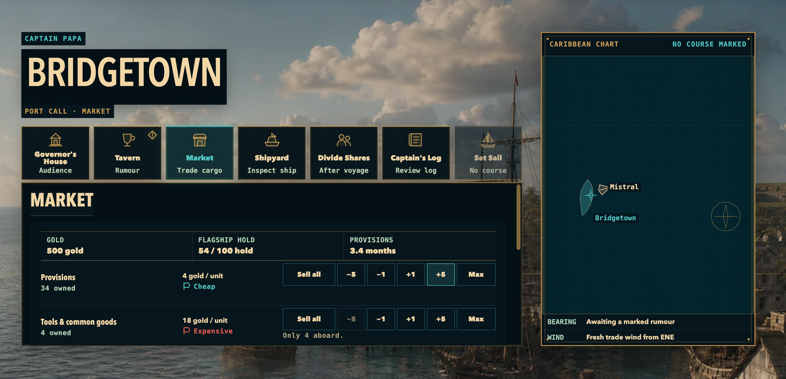
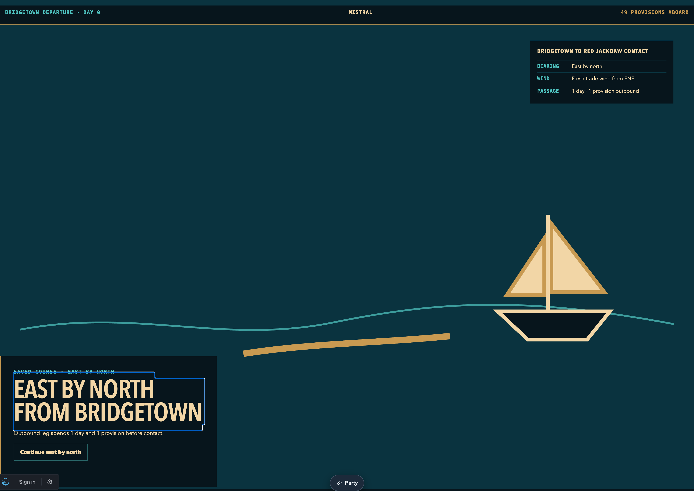
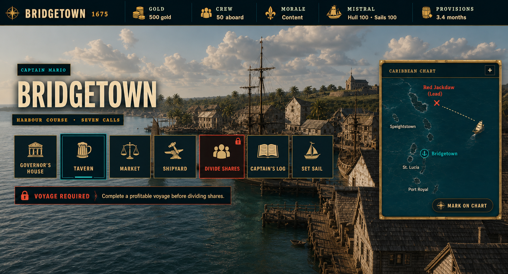
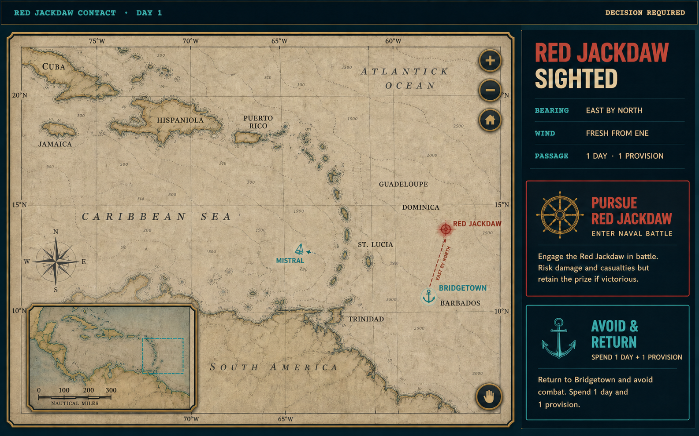

# Caribbean Real-Map and Visual-Parity Direction

**Date:** 2026-08-28

**Status:** Approved direction; implementation pending
**Branch:** `codex/caribbean-game`

## Decision

Do not draw the Caribbean by hand.

The port, departure/sailing, and encounter views will share one geographically
real, zoomable Caribbean map based on the proven KubeCon VPP architecture:
MapLibre GL rendering a small, bundled PMTiles extract. Game-owned routes,
ships, contacts, and labels sit above that real geography. The map remains
fully offline in the installed PWA—there is no runtime tile, style, sprite,
font, or geocoding request.

The current `CaribbeanChart` hand-authored island silhouettes and the
`world-atlas`/`d3-geo` SVG surface are interim implementations. Although the
Natural Earth data is geographic, the 110m land-only projection is too sparse
at island scale and cannot deliver the legible, textured, zoomable chart the
approved concepts require. Neither implementation is the final map surface.

## The visual gap we are closing

### Current port/map implementation — rejected

This review capture is the exact 3238×1564 PNG Mario shared on 2026-08-28
(`sha256 3ddac0d4c4a0438c6af250c50d9eedb9376d94db202f7511a92e9a9d9b3b60a1`).
The port framing is useful, but the chart is a diagram rather than a real map
and the whole result remains materially flatter than the concept.

### Current departure/sailing implementation — rejected

This is the exact 3780×2680 PNG Mario shared on 2026-08-28
(`sha256 89e31e1d398e42173e5d9b630a0a2c8e2f905c95808cd0d246af494ffc5b1da1`).
The sparse vector boat, single wave line, and oversized empty field are not an
acceptable approximation of the map-led experience.

### Approved targets

The implementation does not need to copy generated lettering or fabricate
locations, but it must close the material gap in information hierarchy,
geographic richness, atmosphere, and density.

## Reference architecture: KubeCon VPP

The local reference project is `kubecon-2026-vpp`, pinned during this decision
at commit `12bf316cb71194e693033e984b95cc52675dddfe`. Its useful pattern is:

1. MapLibre owns geographic projection, pan, zoom, and rendering.
2. A regional PMTiles archive provides real vector geography.
3. A local style transforms general map data into the product's visual system.
4. Product-specific markers and animated layers remain application-owned.

Reference source:

- [Map style and local PMTiles selection](https://github.com/lerenzo-enpal/kubecon-2026-vpp/blob/12bf316cb71194e693033e984b95cc52675dddfe/presentation/src/utils/mapStyle.js)
- [Regional PMTiles extraction](https://github.com/lerenzo-enpal/kubecon-2026-vpp/blob/12bf316cb71194e693033e984b95cc52675dddfe/presentation/scripts/offline-download-maps.sh)

The arcade deliberately differs in one respect: KubeCon can fall back to CARTO
at runtime, while the family arcade cannot. The Caribbean game ships its map
pack and style with the PWA and fails closed during build/test if either is
missing.

## Runtime architecture

### Map engine and data

- Use `maplibre-gl` through `react-map-gl/maplibre`.
- Use the PMTiles protocol and a production-owned eastern-Caribbean extract
  generated from a pinned Protomaps/OpenStreetMap source snapshot.
- Begin with the authored play region: the Lesser Antilles, Barbados, Trinidad,
  and their approaches. Expand the extract only when the game authors a route
  outside that boundary.
- Keep the source date, license/attribution, extraction command, bounding box,
  zoom range, SHA-256, and byte size in a checked-in asset report.
- Use an inline, local MapLibre style. Do not reference remote styles, glyphs,
  sprites, tile URLs, or geocoders.
- Avoid general map symbol layers. Render only coastline/land/water/boundary
  context from the tile pack; render game-visible place names as authored
  overlays. This keeps the bundle smaller and prevents an unimplemented city
  from looking playable.

### Shared component

One `CaribbeanMap` surface serves all three contexts:

- **Port:** a restrained eastern-Caribbean overview beside the port activity;
  Bridgetown, the flagship, known leads, and the selected route are visible.
- **Departure/sailing:** the map becomes the main play surface. The ship moves
  along its real route instead of flying through an empty vector field.
- **Encounter:** the same camera and symbology frame the player and contact,
  with Pursue/Avoid decisions layered beside—not over—the map.

The map accepts content-owned geographic features and view presets. It does not
hard-code future ports or infer game rules from map data.

### Interaction

- Pointer drag pans; wheel/pinch and visible buttons zoom; Reset returns to the
  deterministic context preset.
- Keyboard users can focus the map controls, pan with arrows, zoom with `+`/`-`,
  and reset with `Home`.
- Port may begin in a restrained camera preset, but it uses the same real map
  renderer and can be expanded/zoomed; it is not a second decorative chart.
- All camera bounds are deterministic and prevent losing the authored Caribbean
  region.
- Reduced motion disables animated route pulses and camera easing.

### Game overlays

- Bridgetown, Mistral/current flagship, Red Jackdaw, route legs, bearing, wind,
  and voyage cost derive from existing campaign content/state.
- Unauthored locations may exist in the geographic basemap but receive no game
  marker, button, or emphasized label.
- Route and marker hit targets are application layers with explicit accessible
  names and at least 44px pointer targets where interactive.
- MapLibre attribution remains visible and readable.

## Performance and offline budget

- Extract only the eastern-Caribbean play region and the zoom levels the UI can
  reach; do not bundle a world or planet pack.
- Measure the PMTiles archive before promotion. Target at most 8 MiB and treat
  12 MiB as the hard ceiling; lower maximum zoom or simplify layers if it
  exceeds the ceiling.
- Lazy-load MapLibre and the map pack with the Caribbean game so other arcade
  games do not pay the cost.
- Precache the final local map asset deliberately and test offline use after a
  clean install.
- Use MapLibre GeoJSON/source layers for the small route/marker set. Do not add
  DeckGL unless later gameplay requires thousands of animated objects.

## Migration boundary

1. Preserve the current component and evidence behavior with focused tests.
2. Introduce the shared MapLibre surface and local data pack behind the same
   content-owned marker/route contract.
3. Replace `components/map/CaribbeanMap.tsx` first, then retire the separate
   hand-authored `components/port/CaribbeanChart.tsx` by using the shared map in
   port.
4. Replace the sparse departure illustration with the same map and route model.
5. Remove `world-atlas`, `topojson-client`, and `d3-geo` only after no other
   production consumer remains.

This migration changes presentation and map infrastructure only. It does not
change voyage outcomes, persistence, route costs, battle rules, or the existing
QWERTY battle command contract.

## Acceptance and self-review

- The app makes zero map-related network requests after the initial local page
  load; offline mode remains playable.
- Port, departure, and encounter share the same coastline geometry and marker
  coordinates.
- The current-gap screenshots above can no longer describe the implementation:
  no hand-drawn island, no placeholder sailboat, and no giant empty sea.
- Canonical desktop screenshots are compared side by side with the approved
  port and encounter concepts; compact layout is a safety adaptation, not a
  second visual design.
- Tidewave is used for source-aware player-side inspection, Playwright MCP for
  live interaction/geometry/console/network review, and the committed
  hash-aware screenshot harness for reproducible evidence.
- Screenshot files change only when bytes change and every changed image is
  inspected at original resolution before commit.
