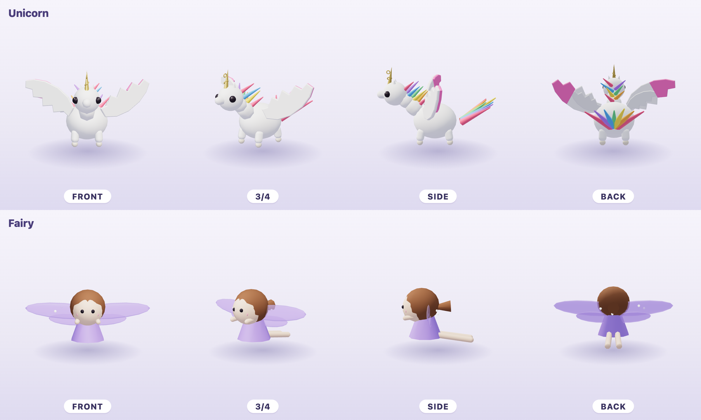
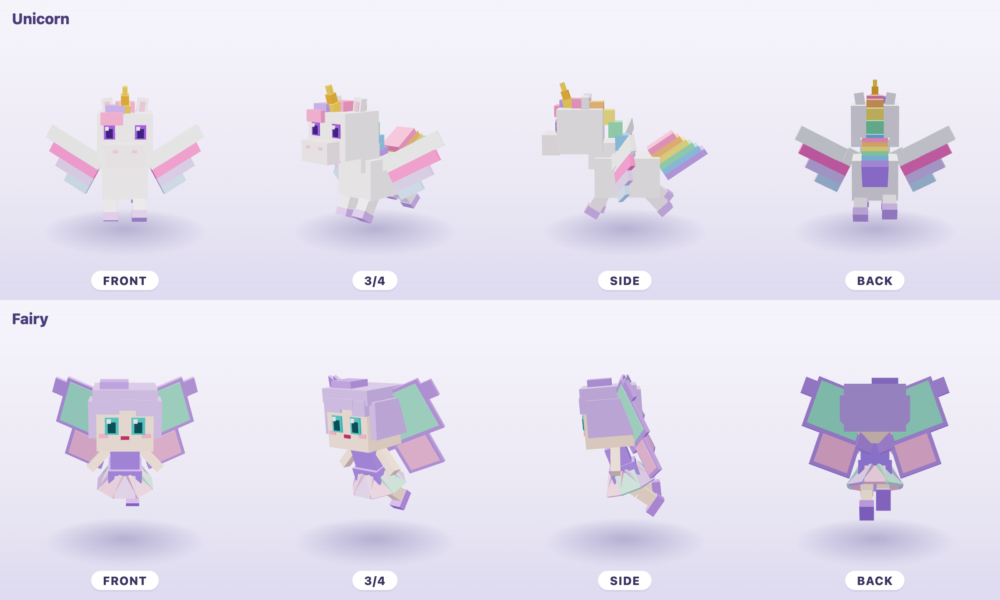
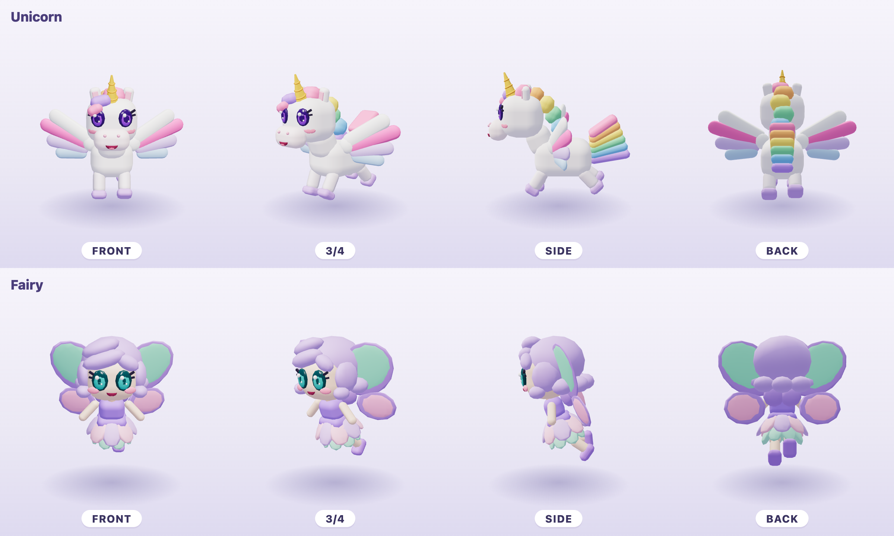
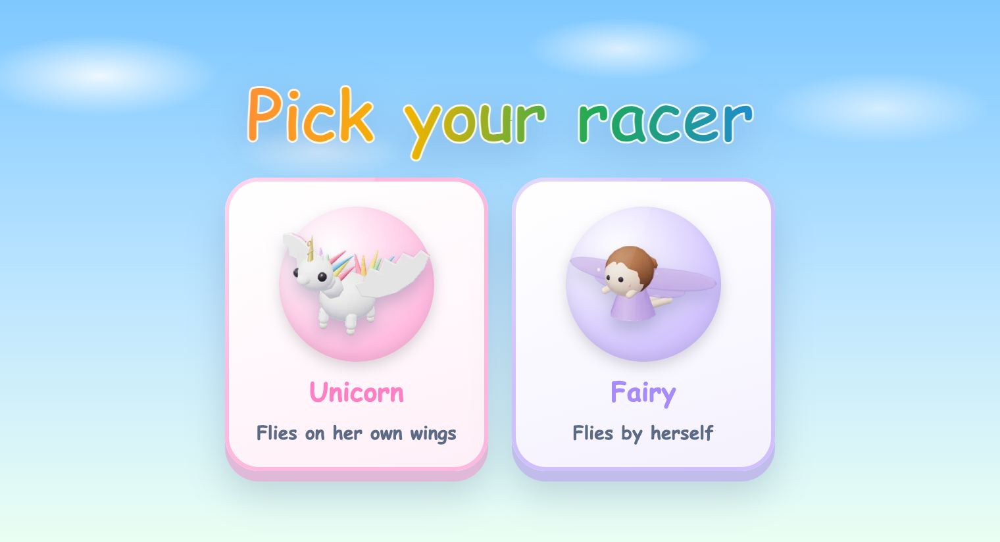
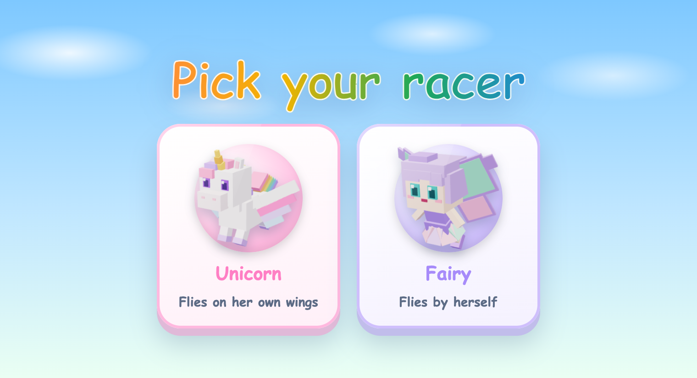
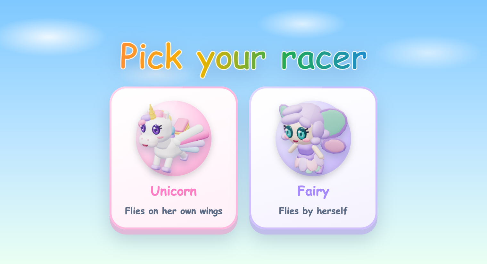
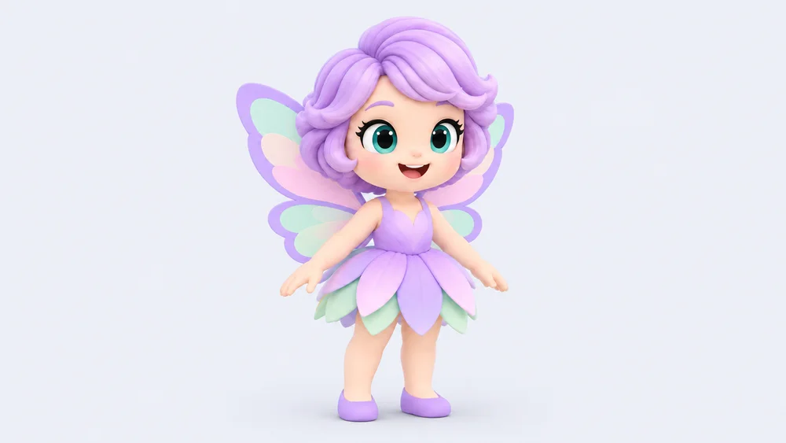
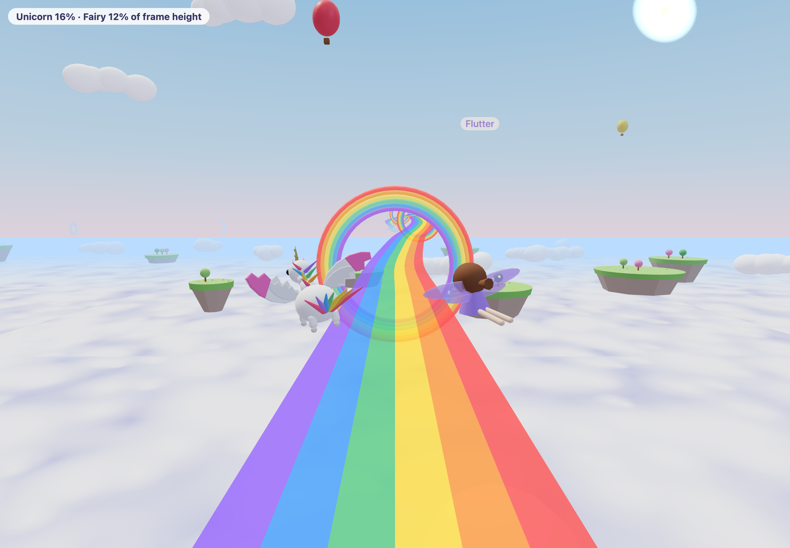
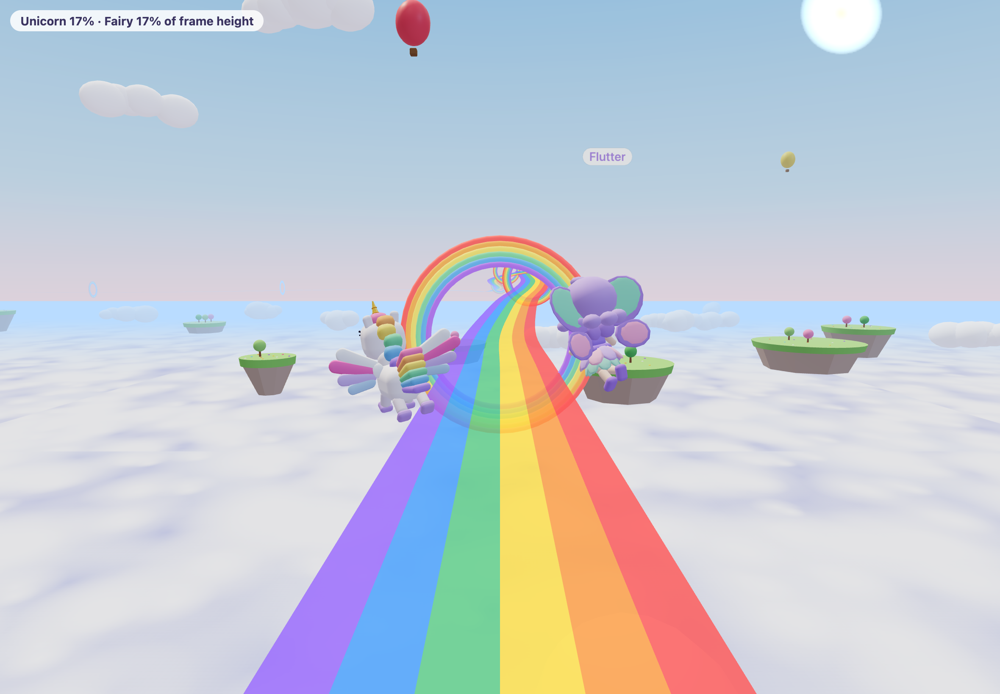

# Chunky racers

**Product direction:** Rainbow Racer's unicorn and fairy become game
characters: chunky, few-part, flat-coloured figures in the style of
kart games with blocky animals, built directly in three.js code. The renders
below are the concept art; the look the family picks becomes the game asset.
The characters stay ours: the unicorn is pearly white with a rainbow mane and
tail, a gold horn, lavender hooves, violet eyes and wings; the fairy is a girl
with a lavender bob, teal eyes, a petal dress and mint and lavender butterfly
wings. Both fly under their own power, with hinge animation only (wing flap,
bob, head tilt, tail sway).

## The page

[racer-chunky.html](./racer-chunky.html) opens from disk and shows the
spectrum left to right, each as a turntable, a pick card and in race:

| Today | A, close match | B, in between | Mallow sheet |
|-------|----------------|---------------|--------------|
|  |  |  |  |
|  |  |  |  |
|  |  |  | not buildable at race size |

Every picture except the Mallow sheet is a render of the real code, from the
harness `preview-racer-cast.html?style=today|a|b&view=turntable|pick|race`
(built only under `BUILD_HARNESS=1`). The in-race view is the game's own
`RacerScene`: its sky, chase camera and light, with both racers banking into a
turn so the camera sees them from behind and to the side, at race size. The
chip in its corner gives each racer's share of the frame height, measured from
the model.

## The options

- **A, close match.** Hard boxes and flat colour, as close to the reference
  style as the characters allow: a cube head, square eyes with one white
  highlight, the mane and tail as stepped rainbow blocks, wings as stepped
  slabs, the fairy's skirt as a ring of flat petals and her wings as rimmed
  panels.
- **B, in between.** A's frame and proportions in rounded blocks, carrying the
  Mallow signatures: big glossy eyes with a highlight (violet, teal), two
  lash blocks, blush, a small open smile, a spiral gold horn, rainbow locks,
  three rounded feathers over a white covert, oval butterfly wings, a bob that
  curls up at the hem.

## What each costs

| | Draw calls (unicorn / fairy) | Triangles (unicorn / fairy) | Code per character | Another character in this look |
|-|-|-|-|-|
| Today | 46 / 23 | 4,156 / 2,688 | in `riders.ts` | shipped |
| A | 5 / 4 | 612 / 588 | about 70 / 60 lines | about 1 to 2 hours of agent time |
| B | 6 / 5 | 7,126 / 7,126 | about 90 / 75 lines | about 2 to 3 hours |

Both looks share the kit in `src/games/racer/three/chunky/`: `kit.ts` (boxes,
rounded blocks, balls, pills and curls merged into one vertex-coloured mesh per
rigid part), `index.ts` (the `Rider` contract from `riders.ts`, with the same
bank, climb, tier growth, wings power-up and reduced-motion behaviour) and
`palette.ts`. No textures, models or fetched assets. `chunky.test.ts` holds the
budgets: at most 8 draw calls, at most 1,000 triangles in A and 8,000 in B,
two wings that mirror each other and hold still under reduced motion.

The game does not use the kit yet. `RacerScene` takes an optional rider
factory, which the harness passes; the game passes nothing and keeps today's
riders.

## Recommendation

**B, in between.** It keeps what was approved in the Mallow sheets, the faces
above all, while reading as a game character; both racers fill 17% of the
frame in race, and each costs five or six draw calls against today's 23 and 46.

**The weakest option is A's fairy.** From the chase camera she is a cluster of
lavender panels, and up close her square face looks plain beside the sheet. A's
unicorn holds up well; A is the cheapest look and the truest to the reference,
but it gives up the faces.

Known rough edges in B, to fix if it is picked: the mane reads as a string of
beads in profile; the top tail lock shows as a flat pink paddle from the front
three-quarter; from behind the fairy is mostly lavender, so her wings carry
her; and at about 7,000 triangles each, B costs more triangles than today
(fewer draw calls matter more on the iPad, but the rounded blocks can be cut
further).

## Outcome

Pending: the family picks A or B.
