# Chunky racers

**Product direction:** Rainbow Racer's unicorn and fairy become game
characters: chunky, few-part, flat-coloured figures in the style of
kart games with blocky animals, built directly in three.js code. The renders
below are the concept art; the look the family picks becomes the game asset.
The characters stay ours: the unicorn is pearly white with a rainbow mane and
tail, a gold horn, lavender hooves, violet eyes and wings; the fairy is a girl
with a lavender bob, teal eyes, a petal dress and mint and lavender butterfly
wings. Both fly under their own power, with hinge animation only (wing flap,
bob, head tilt, tail sway).

## The page

[racer-chunky.html](./racer-chunky.html) opens from disk and shows the
spectrum left to right, each as a turntable, a pick card and in race:

| Today | A, close match | B, in between | Mallow sheet |
|-------|----------------|---------------|--------------|
| 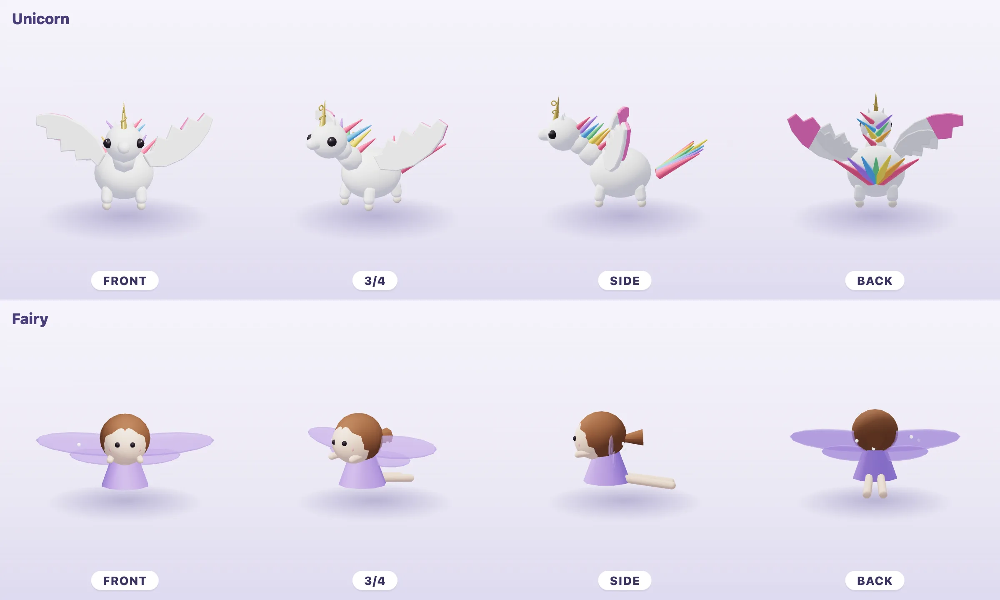 | 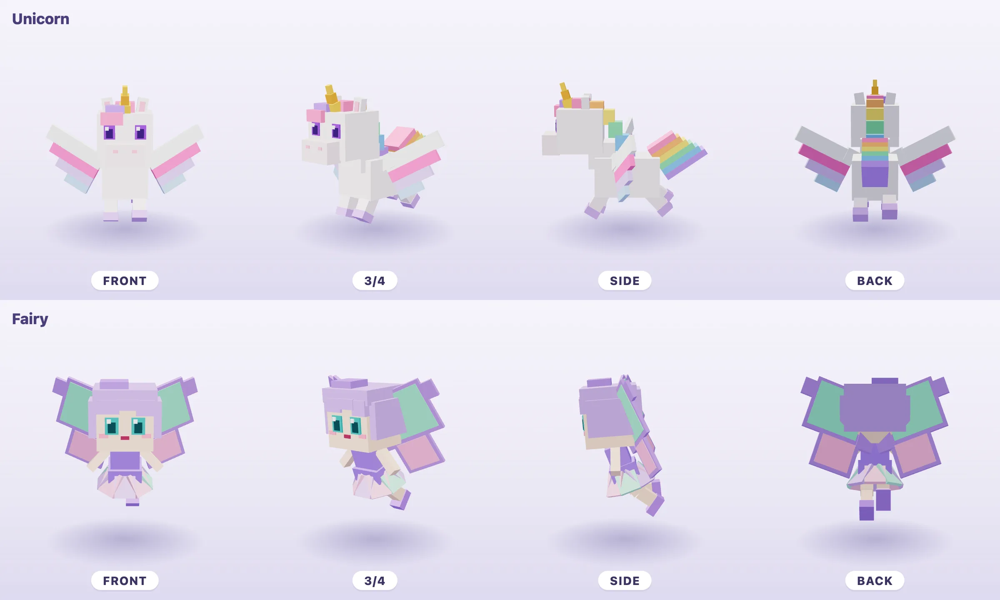 | 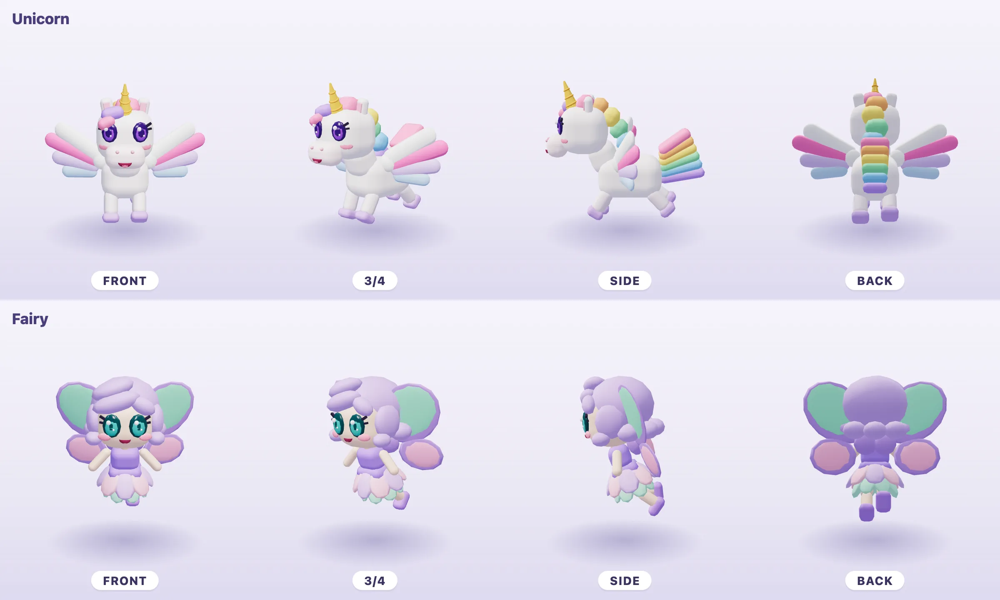 | 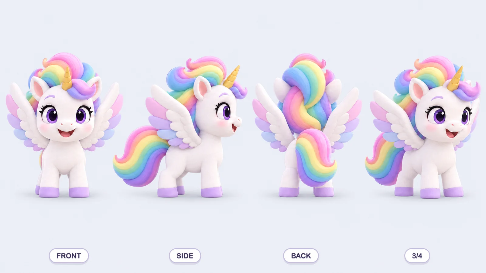 |
| 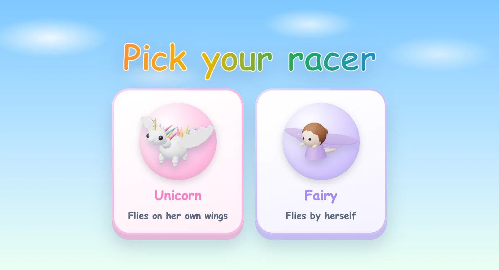 | 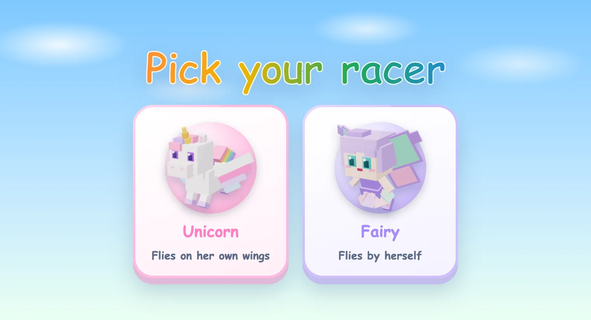 | 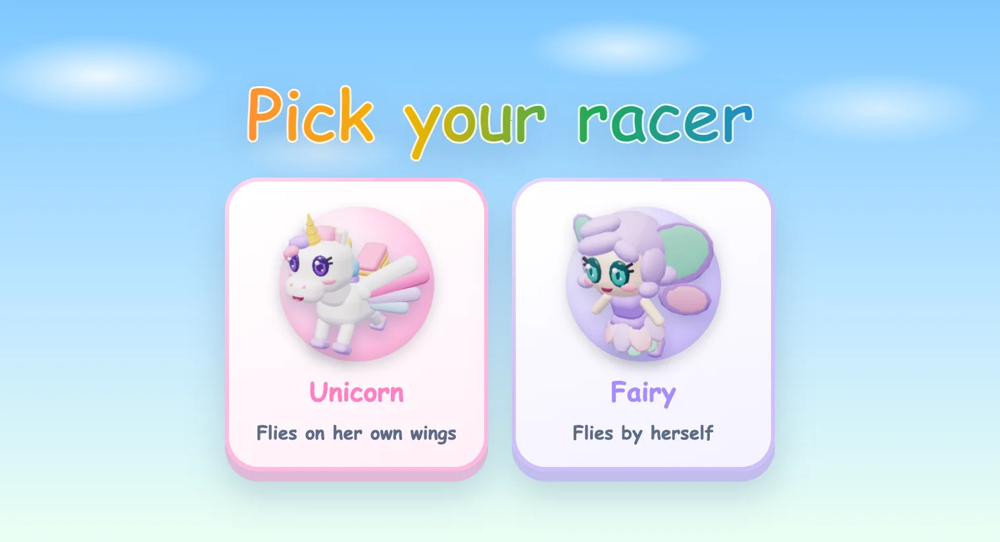 |  |
| 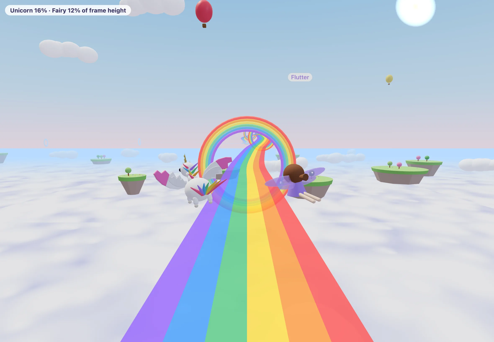 | 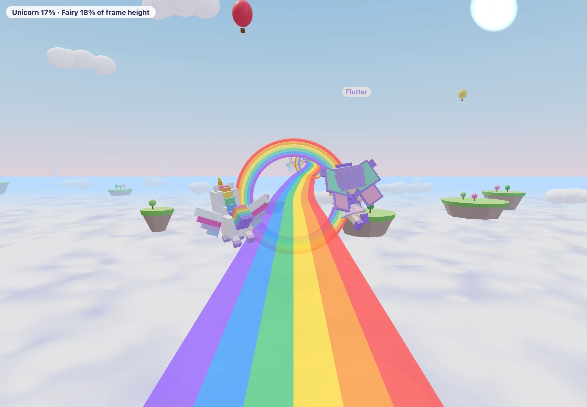 |  | not buildable at race size |

Every picture except the Mallow sheet is a render of the code as pitched, kept
in this folder. The in-race view is the game's own `RacerScene`: its sky,
chase camera and light, with both racers banking into a turn so the camera
sees them from behind and to the side, at race size. The chip in its corner
gives each racer's share of the frame height, measured from the model.

## The options

- **A, close match.** Hard boxes and flat colour, as close to the reference
  style as the characters allow: a cube head, square eyes with one white
  highlight, the mane and tail as stepped rainbow blocks, wings as stepped
  slabs, the fairy's skirt as a ring of flat petals and her wings as rimmed
  panels.
- **B, in between.** A's frame and proportions in rounded blocks, carrying the
  Mallow signatures: big glossy eyes with a highlight (violet, teal), two
  lash blocks, blush, a small open smile, a spiral gold horn, rainbow locks,
  three rounded feathers over a white covert, oval butterfly wings, a bob that
  curls up at the hem.

## What each costs

| | Draw calls (unicorn / fairy) | Triangles (unicorn / fairy) | Code per character | Another character in this look |
|-|-|-|-|-|
| Today | 46 / 23 | 4,156 / 2,688 | in `riders.ts` | shipped |
| A | 5 / 4 | 612 / 588 | about 70 / 60 lines | about 1 to 2 hours of agent time |
| B | 6 / 5 | 7,126 / 7,126 | about 90 / 75 lines | about 2 to 3 hours |

These are the costs as pitched; the built cast's are under Outcome.

## Recommendation

**B, in between.** It keeps what was approved in the Mallow sheets, the faces
above all, while reading as a game character; both racers fill 17% of the
frame in race, and each costs five or six draw calls against today's 23 and 46.

**The weakest option is A's fairy.** From the chase camera she is a cluster of
lavender panels, and up close her square face looks plain beside the sheet. A's
unicorn holds up well; A is the cheapest look and the truest to the reference,
but it gives up the faces.

Rough edges in B as pitched: the mane reads as a string of
beads in profile; the top tail lock shows as a flat pink paddle from the front
three-quarter; from behind the fairy is mostly lavender, so her wings carry
her; and at about 7,000 triangles each, B costs more triangles than today
(fewer draw calls matter more on the iPad, but the rounded blocks can be cut
further).

## Outcome

**B, picked; built.** The whole cast flies in B and today's riders are gone:
the unicorn, the fairy, the princess and the bunny, and the three rides (a
cloud, the bird, the unicorn). `three/riders.ts` rigs them behind the `Rider`
contract; `three/chunky/` holds the kit, the shared face, and one file per
character.

| Turntable | Other rides | Pick cards | In race |
|-|-|-|-|
| 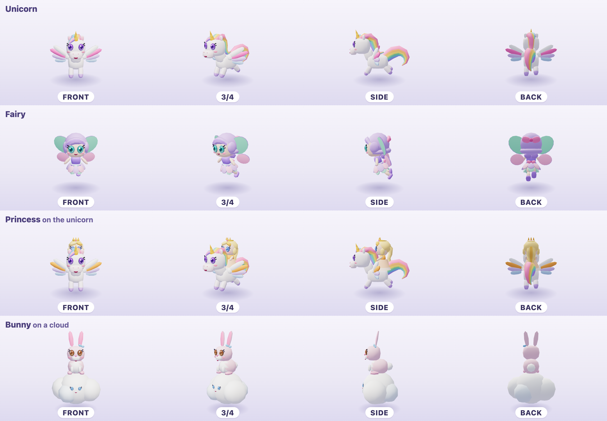 | 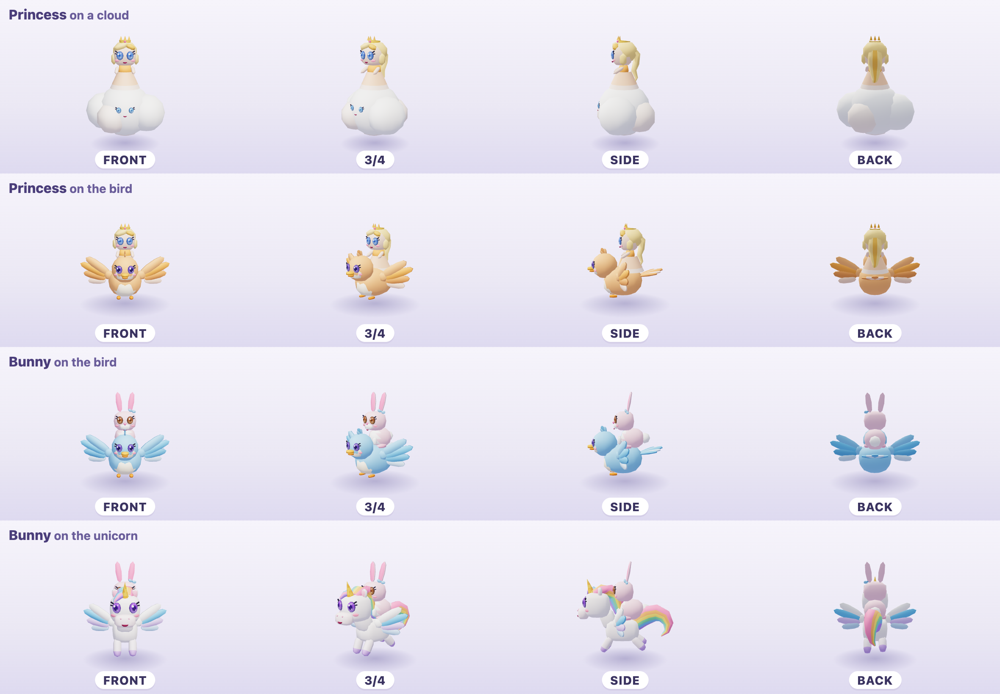 | 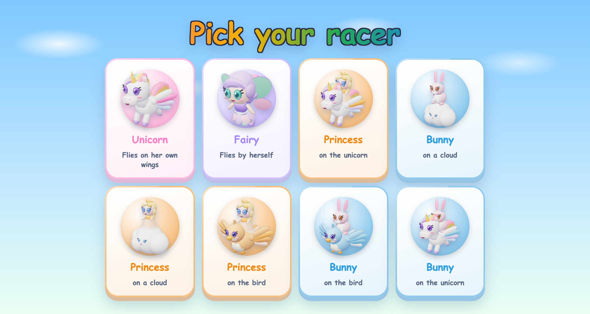 | 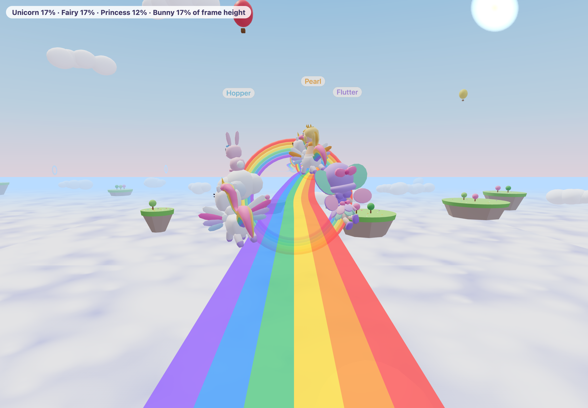 |

The harness `preview-racer-cast.html?view=turntable|pick|race` (with
`&cast=rides`, or a list such as `&cast=fairy,princess-bird`) renders them;
the shots cover the iPad and a 393×852 phone in Chromium and WebKit.

- **One part, one draw call.** Each racer is drawn with one material that reads
  gloss per vertex (eyes, horn, crown), so a rigid part is one mesh: four to
  six draw calls a racer, rider and ride together.
- **Under 3,000 triangles a racer**, rider and ride together. Soft blocks are
  superellipsoids with exact normals, so a few segments shade smoothly.
  `riders.test.ts` holds the budget for every racer on every ride.
- **The mane** is one flowing lock in rainbow stripes: flat across the top of
  the head, then turning down the neck so its stripes show in profile.
- **The tail** is one round, striped lock that rises, arcs back and curls
  under, twisting so the chase camera sees its colours.
- **The fairy from behind:** a big pink bow on her hair, a bob that falls to a
  curled hem, a mint sash tied in a pink bow at the back, petals in pink,
  lavender and mint.
- **New in B:** the princess (golden hair, a crown with a pink gem,
  cornflower eyes, a gown in her colour), the bunny (candy pink, a bow in its
  sky blue), the cloud (with a face of its own) and the bird (in its rider's
  colour). Stars grow a racer and its ride; the fairy's wings grow instead of
  her.

| Racer | Draw calls, today → B | Triangles, today → B |
|-|-|-|
| Unicorn | 46 → 5 | 4,156 → 2,068 |
| Fairy | 23 → 4 | 2,688 → 2,872 |
| Princess on the unicorn | 60 → 6 | 5,438 → 2,954 |
| Princess on the bird | 46 → 6 | 6,794 → 2,458 |
| Princess on a cloud | 24 → 4 | 2,474 → 2,270 |
| Bunny on a cloud | 18 → 4 | 24,172 → 2,220 |
| Bunny on the bird | 40 → 6 | 28,492 → 2,408 |
| Bunny on the unicorn | 54 → 6 | 27,136 → 2,904 |

In a solo race at iPad size under a 4× CPU slowdown
(`node scripts/perf-racer.mjs`, four interleaved passes each), both hold the
display's frame rate with no frame over 33 ms. The work inside a frame drops
from 3.0 ms to 2.4 ms on average, lower in every pair, but passes of one
build vary by up to 1 ms, so read it as a small gain at most.
The whole scene sends about 240 draw calls a frame against 280.

Open for the family: the bunny is candy pink (the old one was lavender), and a
ride takes its rider's colour, so the princess's bird is apricot.
