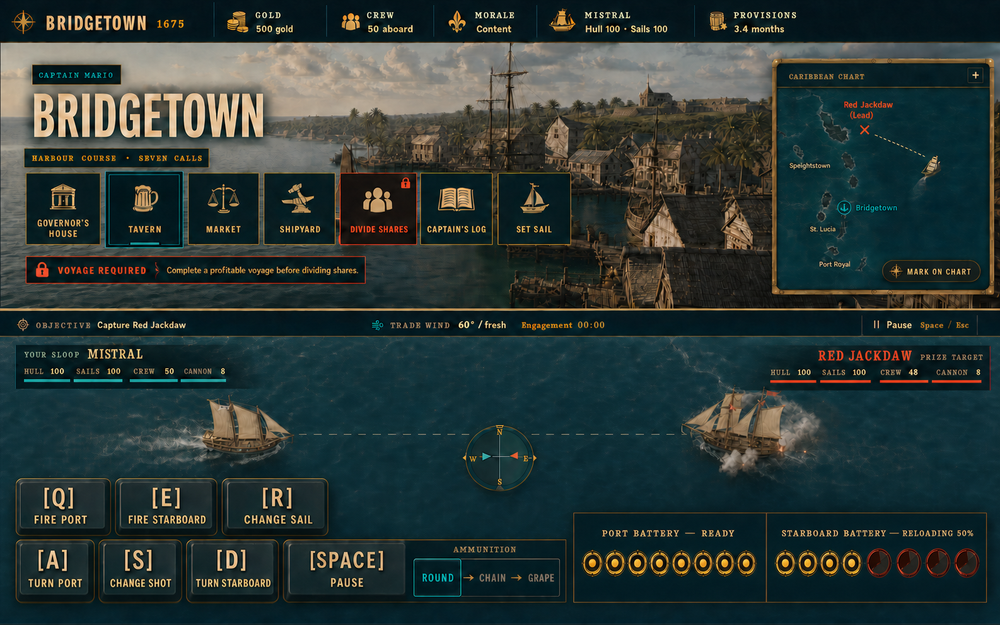
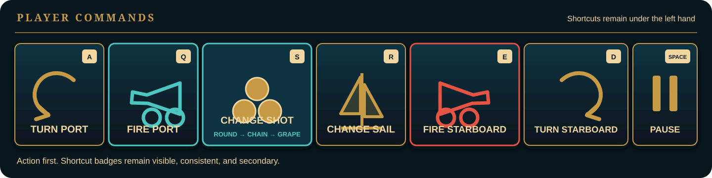

# Caribbean Port and Battle UI Design

**Date:** 2026-08-26

**Status:** Draft for user review

**Branch:** `codex/caribbean-game`

## Outcome

Reshape the Caribbean game’s port and naval-battle interfaces so they feel like the control surfaces of a substantial sailing vessel rather than a collection of shifting web panels.

The finished interface must:

- keep every port activity anchored in one stable frame;
- make available, blocked, and attention-needed actions understandable at a glance;
- show the known Caribbean route on a truthful chart without inventing playable content;
- communicate the complete implemented keyboard vocabulary next to the actions it controls;
- make broadside readiness legible without changing the underlying cannon rules; and
- give ships visible mass by calming the ocean and concentrating motion at hulls, wakes, and impacts.

## Approved Visual Direction



The concept image is an art-direction reference, not a pixel or typography contract. Its useful ideas are the illustrated Bridgetown backdrop, large icon-led port calls, chart as navigational context, mirrored **player** battery status, and large keycaps. The exact shortcut diagram and labels below are authoritative; generated letterforms in the raster concept are illustrative. The extra place names shown on the concept chart are atmosphere only; phase one must not expose them as real destinations.



The distinctive visual signature is a **captain’s working chart laid over the harbor and battle surfaces**: the same brass, signal-red, sailcloth, and ink language connects port decisions to naval commands. This is not a generic dashboard and not a literal imitation of any Pirates release.

## Reference Lessons

The design borrows interaction lessons, not artwork or branding, from the original *Sid Meier’s Pirates!* and its later naval interface:

- the play space remains dominant;
- the currently relevant ship status stays visible rather than hiding behind a submenu;
- a few consistent commands are easier to learn than a changing cluster of contextual controls;
- cannon readiness should be visible before the player attempts to fire; and
- the map should explain where the ship is going, not merely decorate a voyage button.

The locally archived third-party references remain research material under `.superpowers/` and are not shipped in the PWA.

## Scope

This design covers:

1. Start Career form geometry and readability.
2. The shared Bridgetown port shell and activity navigation.
3. Tavern, Market, Divide Shares, Set Sail, and chart-related states.
4. The strategic sailing battle HUD, command rail, broadside readiness, and water motion.
5. Responsive, keyboard, accessibility, and screenshot-evidence contracts for those views.

This design does **not** add:

- a second playable port;
- a free-roaming overworld;
- additional voyage content or economies;
- independently loaded cannon simulation or partial broadside firing;
- new ship classes; or
- remote fonts, artwork, or other runtime downloads.

## Visual System

### Palette

Keep the established maritime palette and strengthen only the actionable danger/accent red:

| Role | Value | Use |
|---|---:|---|
| Deep keel | `#07151d` | page and battle foundations |
| Harbor glass | `#0b3340` | panels and chart overlays |
| Trade wind | `#4ec5c1` | selection, navigation, positive progress |
| Sailcloth | `#f1d6a1` | primary text and parchment surfaces |
| Signal red | `#e55243` | blocked actions, hostile markers, firing state |
| Brass | `#c79a45` | borders, headings, loaded state, chart hardware |

Signal red replaces the weaker `#d94b3d` in the port UI. It reaches approximately 4.96:1 against deep keel and is strong enough to read as an intentional warning without becoming neon.

### Typography

- Display headings retain the game’s characterful maritime serif treatment.
- Action names remain concise and prominent.
- Labels and persistent utility copy use at least 16px where space permits.
- No authored or measured text may fall below the repository’s 14px accessibility floor.
- Keyboard keycaps use the compact utility face, but never replace the written action label.

### Surface language

- Panels are dark harbor glass with brass structural edges, not disconnected floating cards.
- Icons are existing or new local line SVGs using `currentColor`; never emoji.
- Signal colors encode state. Texture and borders provide atmosphere but cannot be the only state cue.
- Focus rings appear for `:focus-visible`, not merely because the application moved focus programmatically.

## Start Career

The setup form becomes one disciplined instrument panel.

- Every label begins on the same baseline within its row.
- Every text field, select, and segmented control has an exact 48px control height.
- Fields use top-aligned internal layout rather than stretching to fill a taller grid track.
- Captain name, pronouns, and talent controls share the same y-position and visible height at desktop widths.
- Helper text occupies reserved space below its control and cannot stretch sibling controls.
- Labels are at least 16px.
- The **Start Career** button label is at least 17px and the full button has a minimum 48px height.
- The angled decorative line currently crossing the top of the view is removed or clipped to its intended panel boundary.

At narrow widths, fields stack in the same logical order while retaining their exact control height.

## Shared Port Shell

### Stable vertical anchor

Every activity uses the same outer port stage. Switching tabs must not re-center the content based on its height.

- The stage anchors from the top of the usable middle track with one proportional offset, represented by a shared token such as `clamp(28px, 7vh, 76px)`.
- The stage width, heading baseline, activity-navigation position, and bottom action boundary remain fixed between activities at a given viewport.
- Long content scrolls inside the stage. Short content does not vertically center itself or create a large empty footer.
- Market does not use an alternate stretch/recenter mode.
- The Bridgetown artwork remains visible behind the stage and is not dimmed so aggressively that its composition is lost.

### Focus and content replacement

- Programmatically focused activity headings do not show a focus ring.
- Keyboard-focused headings or controls do show the normal visible focus treatment.
- Activity replacement preserves the shell’s outer geometry.
- A completed action may replace its own action slot with status copy, but the slot keeps its height so surrounding content does not jump.

## Port Calls

The port-call rail uses large, full-hit-area tiles rather than small labels floating above separate explanatory copy.

Each tile contains:

- a local SVG icon;
- the action name;
- one compact state line when needed; and
- an optional attention or blocked marker.

The entire visible tile is interactive when enabled. Disabled tiles remain readable and explain the next required action.

### State language

| State | Treatment | Example |
|---|---|---|
| Available | brass or trade-wind edge, normal label | `Tavern` |
| Selected | filled harbor-glass surface and strong edge | active activity |
| Attention | small chart-pin or signal marker | new Red Jackdaw lead |
| Blocked | signal-red inset notice, disabled semantics | Divide Shares before profit |
| Complete | quiet check/status line | rumor marked on chart |

Blocked prerequisites look like actionable error guidance, but they are not announced as runtime failures. Use a static status/description relationship, not `role="alert"`, unless an attempted operation actually fails.

### Copy contract

Copy tells the player why the action matters and what unlocks it.

- Divide Shares eyebrow: **Voyage required**
- Divide Shares message: **Complete a profitable voyage before dividing shares.**
- Divide Shares explanation when available: **Settle the voyage, divide the prize money among the crew, and begin the next expedition.**
- Unavailable label: **Not available until after a profitable voyage.**
- Set Sail prerequisite is represented by an attention marker on **Tavern** and a concise disabled reason on Set Sail. The interface does not repeat a long instruction in multiple places.

## Tavern

- The Red Jackdaw rumor is the primary content and remains readable without scrolling at the standard desktop viewport.
- Before marking, the Tavern tile and **Mark on chart** action share the same attention marker.
- After marking, the action slot becomes a compact **Marked on chart** status in the same reserved area.
- Marking the rumor cannot move the heading, prose, stage, or navigation rail.
- The blue outline around the programmatically focused Tavern heading is removed; keyboard focus remains visible on actual interactive controls.

## Market

- The market ledger receives consistent internal padding on all four sides.
- Commodity rows do not touch the panel edge or scrollbar gutter.
- Signal red is strengthened to `#e55243` for sell/danger emphasis while maintaining contrast.
- Successful obvious trades update quantities and totals in place. The redundant **Cargo ledger updated** notice is removed.
- Runtime failures still receive an explicit message near the affected trade control.
- The bottom action is labeled **Done**, occupies a full-width or visually anchored button at the bottom of the market stage, and returns to the port calls.
- Extra space is absorbed by the stable shell rather than appearing as a large dead zone beneath the market menu.

## Caribbean Chart

The chart is a first-class navigational explanation, not a decorative list of fictional destinations.

### Phase-one truth

The chart shows only information backed by current domain data:

- Bridgetown as the current port;
- the player’s current ship position;
- the known Red Jackdaw contact or lead;
- the authored bearing/route between them;
- the voyage’s provision cost or readiness state; and
- completed/returned state after the voyage.

The chart may show coastline silhouettes, compass lines, grid marks, and unnamed landmass context. It must not render Speightstown, St. Lucia, Port Royal, or any other location as a selectable port until those places exist as authored content.

### Architecture

`CaribbeanChart` consumes content-owned markers and route legs rather than hard-coding UI-only destinations. Its input shape supports future ports, but the initial dataset contains only Bridgetown and the Red Jackdaw voyage.

### States

- **Rumor available:** the Red Jackdaw lead pulses or carries an attention marker; no route is drawn as committed.
- **Marked on chart:** the marker and bearing line become persistent.
- **Ready to sail:** route, ship, and provision cost are visible beside the enabled Set Sail action.
- **Underway:** the ship marker occupies the current route position when that data exists.
- **Returned/completed:** the route becomes a quiet historical trace rather than an active alert.

Motion is subtle and disabled under `prefers-reduced-motion`.

## Naval Battle Layout

The battle view presents one continuous command surface:

1. mission and wind information at the top;
2. the dominant ocean and ships in the center;
3. mirrored port/starboard battery readiness tied visually to the ship;
4. ammunition and sail state in the command rail; and
5. pause/options as secondary controls.

The scene remains dominant. Status panels frame it rather than covering the ships.

### Keyboard communication

The persistent battle controls use one compact left-hand QWERTY cluster. Their visual arrangement mirrors their physical relationship on the keyboard:

```text
[Q] Fire port              [E] Fire starboard   [R] Change sail
[A] Turn port   [S] Change shot   [D] Turn starboard
                         [Space] Pause
```

The exact primary bindings are:

| Action | Primary shortcut | Behavior |
|---|---|---|
| Turn port | `A` | held steering command |
| Turn starboard | `D` | held steering command |
| Fire port | `Q` | fire the loaded port battery |
| Fire starboard | `E` | fire the loaded starboard battery |
| Change shot | `S` | cycle `Round → Chain → Grape → Round` |
| Change sail | `R` | toggle the current sail setting |
| Pause / resume | `Space` | toggle battle pause |

`S` replaces the `1`/`2`/`3` ammunition bindings; those number keys no longer change ammunition in battle. Pointer and touch users may still select Round, Chain, or Grape directly from the visible ammunition control. Arrow keys and `Esc` may remain accessibility/familiarity alternatives, but they appear in the pause/help legend rather than competing with the persistent left-hand cluster.

Written labels remain primary. Each persistent control uses a large high-contrast keycap paired with its action label; the letter cannot be reduced to tiny corner text. Keycaps are secondary cues, not icon-only controls. Touch users receive the same complete command set through full-size buttons.

## Cannon Readiness

The current rules track one scalar reload state per player broadside. The UI must visualize those actual rules rather than imply independently firing cannon entities or reveal hidden enemy timing.

- Port and starboard each receive a mirrored **battery** indicator.
- Each indicator uses a row of cannon or charge segments to make progress glanceable.
- All segments derive from the side’s existing scalar reload fraction.
- The label always states either **Reloading 62%** or **Ready**.
- The Fire button remains disabled until the full side is loaded, exactly as it is today.
- A ready battery uses brass plus a clear **Ready** label; loading uses restrained signal red and a progress fill.
- The selected ammunition appears between the two batteries and remains identified by name beside the `S` change-shot control.
- Screen-reader status announces meaningful transitions such as **Port battery ready**, not every percentage tick.

Exact reload progress belongs only to the player. The enemy panel may show hull, sails, crew, cannon count, and visible damage, but it never shows a reload meter, percentage, battery-ready label, or other exact firing timer. Recent broadside smoke and, where the ship art supports it honestly, animated gunports may act as diegetic clues without exposing the underlying reload value.

Partial individual-cannon fire, crew-assigned reload speeds, or different cannon completion times require a separate gameplay design and are not simulated by this UI.

## Water and Ship Mass

The ocean should establish scale, while the ship creates motion.

- Reduce broad water displacement from the current visually dominant amplitude to a low-amplitude, long-period swell with peak displacement no greater than `0.12` world units.
- Reduce global water-band speed to no more than half its current rate.
- Remove the diagonal wind-line layer from the water surface. Wind direction remains explicit in the compass and mission rail.
- Concentrate higher-frequency motion in bow waves, stern wakes, cannon splashes, and impact rings.
- Limit ambient idle heave to `0.06` world units, pitch to `0.01` radians, and roll to `0.006` radians. Steering and impact responses ease in and out with the inertia of a large wooden ship.
- Add a restrained waterline contact shadow or ambient darkening so hulls sit in the sea rather than float above it.
- Wake width relates to hull beam and wake length relates to speed. Wakes stay broad and subtle rather than becoming bright trails.
- Wind remains legible through the compass/wind UI even when most animated streaks are removed.
- Reduced-motion mode freezes ambient wave travel and nonessential bobbing while preserving readable state changes.

The water change must remain within the established WebGL draw-call, triangle, timing, resource-growth, and deterministic-evidence budgets.

## Responsive and Accessibility Contract

- The existing 960×600 supported floor remains valid.
- Interactive hit targets remain at least 44×44px; primary port and battle controls target 48px or larger.
- Authored and measured text remains at least 14px; labels and important actions target 16–17px.
- Color is never the only signifier of selected, loading, ready, blocked, or attention states.
- Focus-visible order follows the visual reading order.
- Disabled controls expose their reason through accessible description.
- Activity and battle state changes avoid unnecessary live-region chatter.
- All ambient animation respects `prefers-reduced-motion`.

On compact screens, the chart and activity content may stack, but port-call order, labels, and state indicators remain identical. Battle controls may form two rows; port controls stay grouped left, ammunition/sail centered, and starboard controls grouped right.

## Automated Evidence

The existing committed browser harnesses remain the authority:

- `npm run shots` for general UI screenshots with hash-aware no-op writes;
- `caribbean:port-check` for deterministic port and strategic-sailing evidence; and
- `caribbean:naval-check` for naval WebGL evidence and provenance.

The implementation plan must add or refresh evidence for:

- aligned Start Career controls;
- stable port shell at home, Tavern before marking, Tavern after marking, Market, and blocked Divide Shares;
- the truthful chart in rumor, marked, ready, and returned states;
- battle with both batteries ready;
- battle with each side at an intermediate reload state;
- one side ready while the other reloads;
- the complete visible `Q/E`, `A/S/D`, `R`, and `Space` command cluster;
- player battery status with no enemy reload meter or percentage;
- reduced-motion water and fallback battle views; and
- the supported desktop, tablet, minimum, and portrait boundaries already owned by the harnesses.

Geometry assertions must prove:

- Start Career controls share the specified top and height;
- the port heading and navigation top do not move between activity states beyond subpixel rounding;
- Tavern’s action/status slot does not collapse;
- Market padding remains present next to rows and scrollbars;
- every visible command has a complete hit target and implemented shortcut cue; and
- pressing `S` cycles Round, Chain, and Grape in the displayed order while `1`/`2`/`3` do not change ammunition;
- enemy status contains no exact reload or battery-readiness data; and
- cannon progress shown in the DOM matches the underlying scalar reload state.

Screenshot writers continue to hash content and leave a tracked PNG untouched when the new bytes are identical. No test may weaken the established 22+1 strategic-sailing evidence boundary, A-only publication rule, provenance checks, or stable-state/render-observation split.

## Acceptance Criteria

The redesign is complete when all of the following are true:

1. Start Career labels and controls align exactly, controls are 48px high, and primary text is easier to read.
2. No port activity causes the shell heading, navigation, or content anchor to jump vertically.
3. Marking the Tavern rumor changes state without collapsing or shifting the page.
4. Market has balanced padding, stronger red, no redundant success notice, and a bottom **Done** action.
5. Blocked actions use clear signal-red prerequisite messages and full-tile disabled interaction.
6. The chart truthfully shows Bridgetown, the player ship, and the authored Red Jackdaw route without fake playable ports.
7. The persistent battle deck presents the readable left-hand `Q/E`, `A/S/D`, `R`, and `Space` cluster, and `S` cycles Round, Chain, and Grape in order.
8. Both player broadside reload states are immediately distinguishable as loading or ready and remain faithful to scalar per-side mechanics; enemy reload timing is never exposed as UI data.
9. Ships read as heavy: low global wave motion, restrained hull bobbing, strong water contact, and localized wake/impact motion.
10. Browser evidence proves all layout, accessibility, deterministic, performance, provenance, and no-op hash-writing contracts.

## Deferred Decisions

The following require separate product designs because they change content or mechanics rather than presentation:

- adding playable Caribbean ports and inter-port trade routes;
- converting the chart into a free-roaming navigation layer;
- individual cannon loading, crew allocation, or partial broadside fire;
- wind-driven strategic sailing changes beyond the existing controls; and
- new ship classes or battle objectives.
